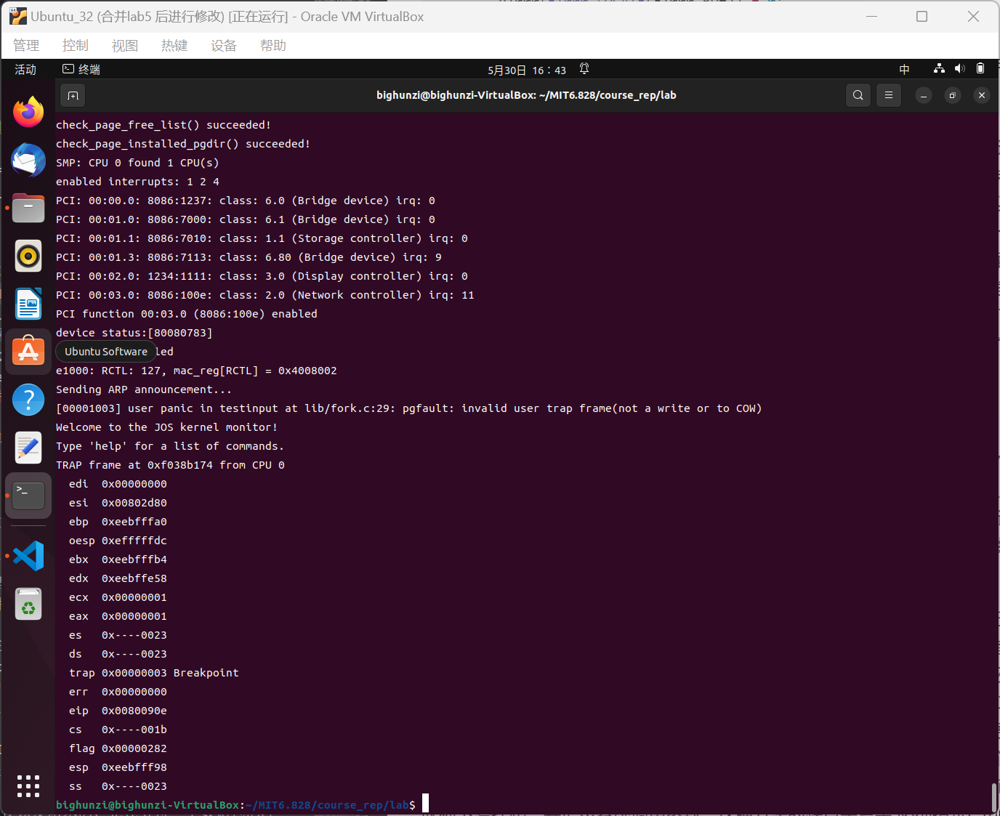

# challenge2-零拷贝
好吧，最终也没有调出来，无法通过lab6中的一些测试程序。所以源代码我也就不上传了，只是利用本地备份了下，这篇笔记只是介绍下我整体的思路和一部分代码的实现，也算是一个备份吧

## lab6 challenge：将E1000驱动程序修改为零拷贝
>chellenge原文：
修改你的E1000驱动程序为“零拷贝”。当前，分组数据必须从用户空间缓冲区复制到传输分组缓冲区，也必须从接收分组缓冲区复制回用户空间缓冲区。零拷贝驱动程序通过直接拥有用户空间和E1000共享数据包缓冲区来避免这一点。对此有许多不同的方法，包括将内核分配的结构映射到用户空间，或将用户提供的缓冲区直接传递给E1000。无论使用哪种方法，重用缓冲区时都要小心，以免在用户空间代码和E1000之间引入竞争。

### lab6驱动程序回顾
lab6的驱动程序主要包括两个部分：发送部分和接收部分。两个过程类似，在用户空间与网卡进行数据交换的过程中，**全都要以缓冲区（也就是lab6中我们定义的静态内存空间：e1000_tx_buffer，e1000_rx_buffer。）为媒介**，即涉及到了两次拷贝。**以发送为例，这两次分别为：e1000.c中的e1000_transmit()，将用户空间的数据拷贝到缓冲区；以及，由网卡操作的，将缓冲区数据发送出去，并置位寄存器，告知我们该部分缓冲区可用。** 我们的目标是去除掉第一步的拷贝，这样cpu实际上一次拷贝都没有做（第二步是网卡做的，DMA），即零拷贝。

注意，其余的数据传输(用户进程与辅助环境通信，即output.c input.c中)，都是通过ipc做的，而ipc改变的是地址映射，并未发生拷贝。

**别忘了：是描述符(e1000_tx_desc_array, e1000_rx_desc_array)指定了缓冲区地址**

### lwip服务器进程回顾
net/serve.c中的umain()应该是该进程的主程序。该进程fork()出三个辅助进程(timer,input,output)。其中，input和output分别负责与e1000驱动程序通信，而timer则是lwip的定时器。
而这个主进程创建用户线程，调用serve()，利用lwip处理辅助进程传入的数据包。

下面再总结下http.c：
**http.c**：umain()正常socket编程后开始调用handle_client()处理描述符，然后调用send_file()发送数据包的各个部分。但是由于linux中(JOS很多细节都与linux相似)一切皆文件的概念，socket也是通过调用我们lab5中接触到的read(),write()的文件读写函数来读写，所以JOS中实际上我们最终还是调用read(),write()来进行读写通信。而lab5中ide磁盘驱动器我们并没有参与编程，只是调用了ide驱动接口。我们暂时还没有能力实现常规意义下的零拷贝，即**在磁盘缓冲区和网卡缓冲区之间进行的，通过共享缓冲区映射，使得cpu完全不需要进行拷贝操作，只需要磁盘和网卡的两次DMA。** 
所以我们所能做得工作也就只剩下的缩减e1000_transmit()/e1000_receive()中的一次拷贝了：

### 实现
综上，我们要修改的其实也就只有e1000.c中的函数了。

challenge题目中就实现方案给出了两种选项：将内核分配的结构映射到用户空间，或将用户提供的缓冲区直接传递给E1000。

在这里，我们似乎不得不将两种方案都实现。因为：
* 发送过程无法采用第一种方案，原本用户内存的变量a已经有了它本就在的物理地址，若要把它放在内核缓冲区中就必须拷贝，而无法通过内存映射将其添加到原先预设好的内核缓冲区。
* 接受过程如果采用第二种方案，那么我们的JOS在**用户程序通过系统调用告知内核：它将要接收数据** 之前，根本就不存在接收缓冲区，那么网卡的DMA自然不会向缓冲区中拷贝。 于是，用户程序提出需求 -> e1000_receive()设置缓冲区描述符地址 -> 此时网卡拷贝才刚刚开始。那么我们后续如果要告知用户程序网卡拷贝完成 可能需要网卡在向缓冲区写完后提出一个中断，这貌似很难，于是我们不得不转向第一种方法，它也更加简单，在lab6的基础上添加映射即可。

另外，challenge1 中的mfq调度程序是无法通过lab6中原来的测试程序的，因为调度算法的不一致可能会造成官方提供的测试程序的输出语句顺序不同，导致测试程序的不同，因此在my_config.h中注释掉`#define CONF_MFQ`，使用最原始的轮询抢占调度

#### 1.组件准备
page_lookup()+page2pa()取出对应虚拟地址对应的物理地址，然后再用物理地址操作描述符。这两个组件无需修改。
`page_lookup(pde_t *pgdir, void *va, pte_t **pte_store)`需要pgdir的地址，获得它使用currenv宏即可

另外，由于我们要通过ipc映射来在用户空间和内核空间传递内存，我们就需要使得核心网络服务器的缓冲区nsipcbuf， 以及接收缓冲区 与页对齐。

#### 2. 发送过程
修改初始化过程以及发送函数（其他一些小的修改地方就不展示了）：
```c
//e1000_transmit_init修改处
#ifndef E1000_ZERO_COPY_TRANSMIT //传统方式
		e1000_tx_desc_array[i].addr=PADDR(e1000_tx_buffer[i]);
#endif //如果采用零拷贝模式，addr初始化不应该赋值，就保持0。

//e1000_transmit修改处 
#ifdef E1000_ZERO_COPY_TRANSMIT //如果采用零拷贝模式，就将用户地址addr转化为物理地址，再设置描述符	
	if((uint32_t) addr>= KERNBASE){
		e1000_tx_desc_array[tdt].addr=PADDR(addr);
	}else{
		struct PageInfo * pp= page_lookup(curenv->env_pgdir, addr, NULL/*此处可以直接用该指针取出物理地址，但目前这样处理编程比较简单*/); //addr对应物理内存
		physaddr_t pa=page2pa(pp);
		e1000_tx_desc_array[tdt].addr=pa;
	}
	
#else
	memcpy(e1000_tx_buffer[tdt] , addr, len);//传统拷贝方法
#endif
```

测试：
运行`make E1000_DEBUG=TXERR,TX NET_CFLAGS=-DTESTOUTPUT_COUNT=100 run-net_testoutput`以及`tcpdump -XXnr qemu.pcap`，可以看到是可以完成发送任务的，但是因为testoutput.c中的测试程序是在一块内存中反复映射，`make grade`的发送部分无法通过，进而导致接收部分也无法通过。。。。。

无奈，只能将接受过程的零拷贝单独写。。。

#### 3. 接收过程

```c
char e1000_rx_buffer[RX_DESC_ARRAY_SIZE][RX_PACKET_SIZE] __attribute__((aligned(PGSIZE)));

//e1000_receive
#ifndef E1000_ZERO_COPY_RECEIVE//传统方式
	memcpy(addr, e1000_rx_buffer[next] , *len);
#else//零拷贝
	//如果是零拷贝，那么input.c中保证了addr与页对齐。
	if(next%2){//单数缓冲区，不与页对齐
		res=1;
	}
	struct PageInfo * pp=page_lookup(curenv->env_pgdir, e1000_rx_buffer[next], NULL);
	page_insert(curenv->env_pgdir,pp,addr,PTE_P|PTE_U);//添加映射
#endif

//input.c中的input
#ifdef E1000_ZERO_COPY_RECEIVE
		if(r>0){//单数缓冲区
			memcpy(nsipcbuf.pkt.jp_data, (void*) ((uint32_t)rev_buf+PGSIZE/2), len);
		}else{
			memcpy(nsipcbuf.pkt.jp_data, rev_buf, len);
		}
#else
		memcpy(nsipcbuf.pkt.jp_data, rev_buf, len);
#endif
```

出错：


### 总结
其实这次零拷贝的尝试可以说是失败了。

其实零拷贝的概念比较简单，有很多博客或者八股都有比较好的介绍。**但是！！ 这些概念全都基于linux宏内核的架构下，而我们的JOS却采用了微内核的架构，网卡驱动的主体其实是实现在网络服务器进程中，网络协议栈移植于此，其他用户进程利用这个特殊进程与网卡通信。**  而且，网络协议栈移植部分和net server进程部分在lab6中也并不是我们所写。这导致我们很难按照零拷贝的概念写出代码并进行测试。。。。。。 


