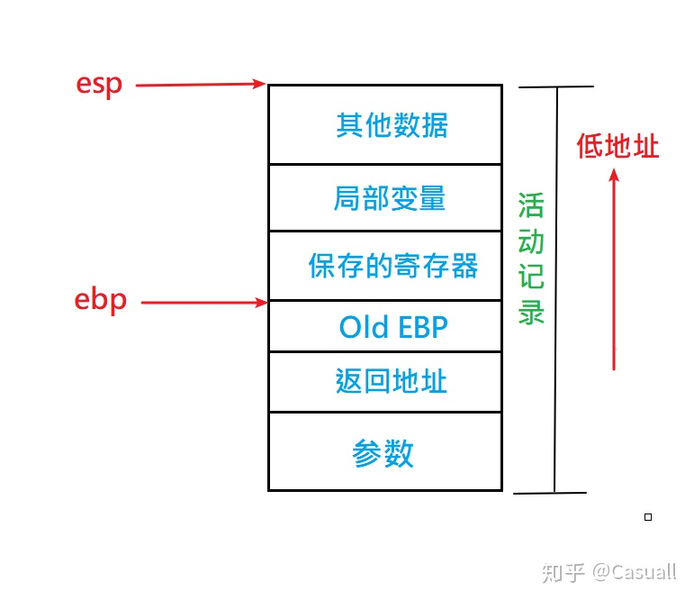

开这个系列的目的：主要梳理下lab重点，方便我去对线面试官

### 开机流程
**PC启动后的运行顺序为 BIOS -> boot loader -> 操作系统内核**

我们可以看到BIOS的操作就是在控制，初始化，检测各种底层的设备，比如时钟，GDTR寄存器。以及设置中断向量表。作为PC启动后运行的第一段程序，它最重要的功能是把操作系统从磁盘中导入内存，然后再把控制权转交给操作系统。所以BIOS在运行的最后会去检测可以从当前系统的哪个设备中找到操作系统，通常来说是我们的磁盘。当BIOS确定了，操作系统位于磁盘中，那么它就会把这个磁盘的第一个扇区，通常把它叫做启动区（boot sector）先加载到内存中，这个启动区中包括一个非常重要的程序--boot loader，它会负责完成整个操作系统从磁盘导入内存的工作，以及一些其他的非常重要的配置工作。最后操作系统才会开始运行。

### elf头文件
elf头文件包含的信息很多，在这里说一下其中几个，有些我们阅读JOS源码和后面会用到的几个。
elf.h中的ELF header数据结构以及Program header数据结构
```c
struct Elf {
	uint32_t e_magic;	// must equal ELF_MAGIC
	uint8_t e_elf[12];
	uint16_t e_type;
	uint16_t e_machine;
	uint32_t e_version;
	uint32_t e_entry;
	uint32_t e_phoff;
	uint32_t e_shoff;
	uint32_t e_flags;
	uint16_t e_ehsize;
	uint16_t e_phentsize;
	uint16_t e_phnum;
	uint16_t e_shentsize;
	uint16_t e_shnum;
	uint16_t e_shstrndx;
};

struct Proghdr {
	uint32_t p_type;
	uint32_t p_offset;
	uint32_t p_va;
	uint32_t p_pa;
	uint32_t p_filesz;
	uint32_t p_memsz;
	uint32_t p_flags;
	uint32_t p_align;
};
```
其中：
* e_magic是项目中要使用头文件所必须要做的检验。例子见于boot/main.c
* e_type 它标识的是该文件的类型。
* e_machine 表明运行该程序需要的体系结构。
* e_version 表示文件的版本。
* **e_entry** 程序的入口地址。**也就是把文件加载到进程后，进程eip寄存器会赋的值**
* **e_phoff** 表示Program header table 在文件中的偏移量（以字节计数）。**它与下面的e_phnum一组合，我们就可以知道所有的段，然后再根据Program header就知道了每个段的信息。按照这些，我们就可以把所有段都加载到内存中**
* e_shoff 表示Section header table 在文件中的偏移量（以字节计数）。Section是链接时候的单位。链接器将多个可重定向文件组合为可执行文件时，相同的 section 整合成一个segment。
* e_ehsize 表示ELF header大小（以字节计数）。
* **e_phnum** 表示Program header table中有多少个条目。


这也是为什么操作系统能够保证进程中用户二进制可执行文件可以加载到虚拟地址的用户间中（低地址），因为我们项目中写的load_icode(), spawn() 以及linux系统中的exec()库底层的函数本身就是根据elf头往内存中拷贝二进制文件。

>见于CS:APP书483页后内容：
链接过程将机器指令文件生成elf可执行文件。elf可执行文件被设计得很容易加载到内存，可执行文件的连续的片被映射到连续的内存段。程序头部表描述了这种映射关系。
操作系统调用加载器来执行可执行目标文件。Linux程序可以通过调用execve（内核级系统调用 exec函数就是调用execve的库函数）函数调用加载器。加载器将可执行目标文件中的代码和数据从磁盘复制到内存中，然后跳转到程序入口。这个过程叫做加载。
每个linux程序都有一个运行时内存映像，在linux x86-64中，代码段总是从0x4000000处开始


### 函数调用过程
**注：此处过程只限于x86， 并不包括x64。**

**因为：** 
* x64函数调用时传参用寄存器+ 栈。当参数少于6个时候只需要寄存器，多于6个时候需要栈。
* **但是！！！！我们在项目中也看到了** x86（即32位操作系统）：函数调用时传参只用栈，这也是为什么我们在项目中通过栈帧查看调用参数！！
一个介绍这个的博客：https://blog.csdn.net/m0_55708805/article/details/117388229  我自己也编译了一下，确实如此。


**函数调用过程（结合汇编）：**
`call`相当于`push eip`+`jmp`，
`ret`相当于`pop eip`
相关概念：栈帧 ebp至esp  包括内容有：寄存器（包括最先压栈的ebp），局部变量等
函数调用参数和返回地址在上一个栈帧中
函数调用过程：参数压栈->call->函数体->ret
函数体标准开头：
```asm
push ebp
mov esp,ebp 
sub esp, xxx//调整栈帧大小
push //寄存器
```

函数返回过程：
```asm
mov xxx,eax//保存返回值
mov ebp,esp//恢复esp
pop ebp//恢复栈帧
ret
```

另外：[函数调用时寄存器的保护](https://gitbook.coder.cat/function-call-principle/content/save-and-restore-of-registers.html)

以及栈帧结构示意图：
