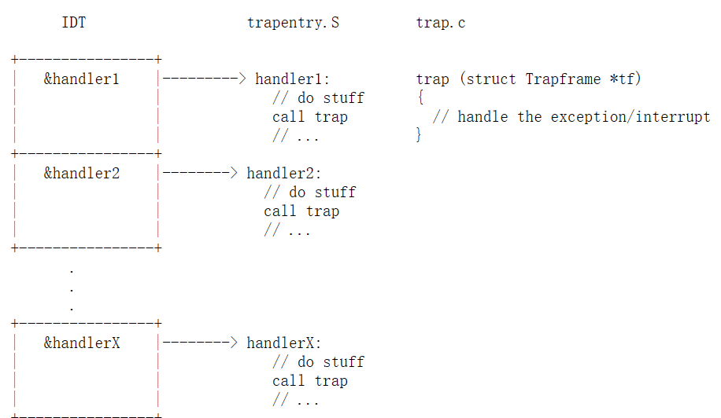
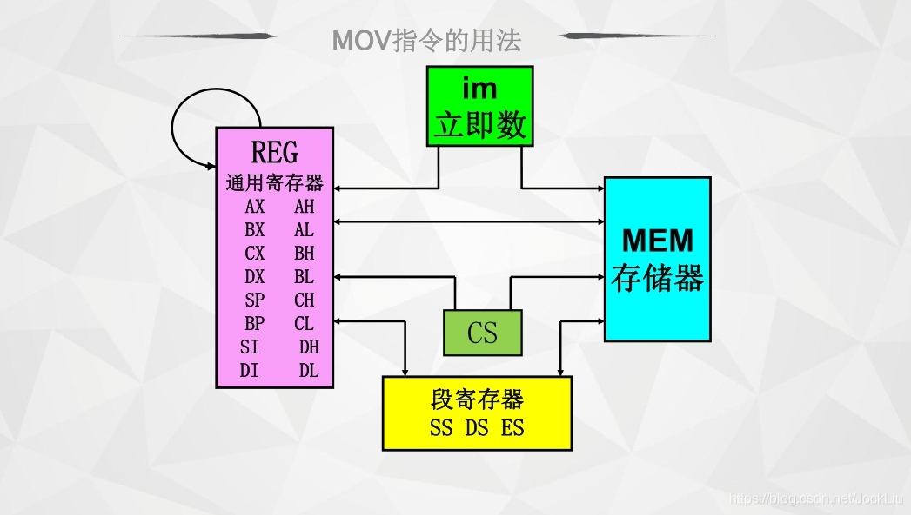
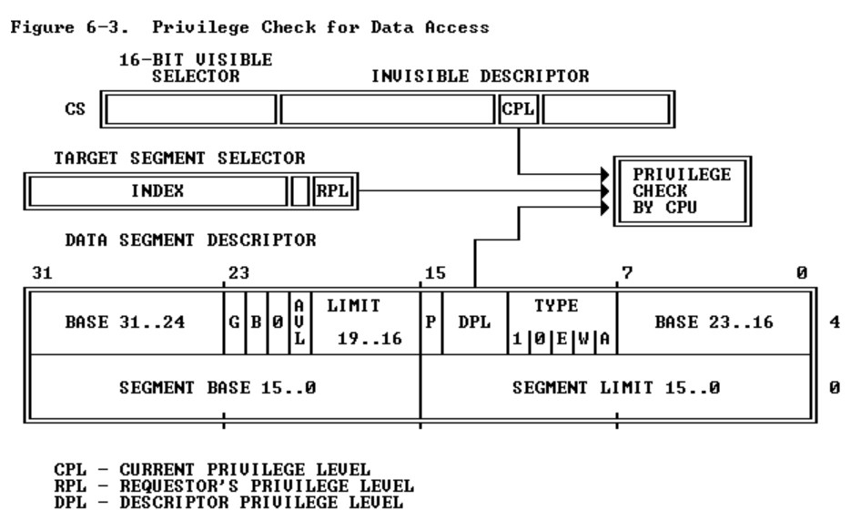
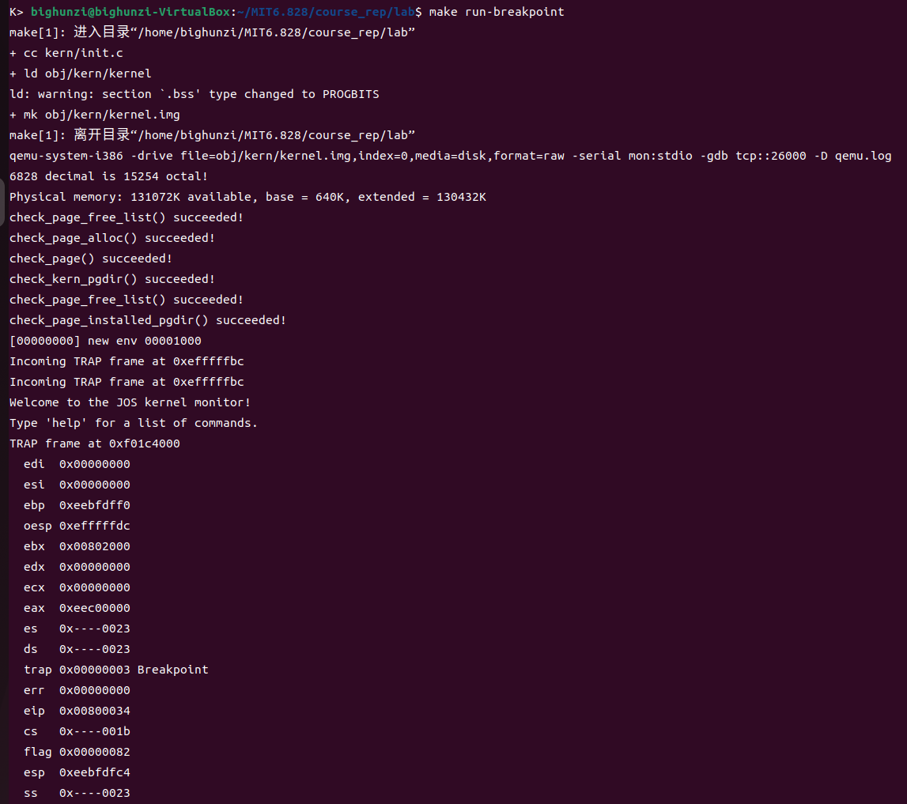

# lab3 （中断和syscall部分应该反复看，直到理解！！！）

在本实验中，将实现运行受保护的用户模式环境(即“进程”)所需的基本内核设施。将增强JOS内核，以设置数据结构来跟踪用户环境，创建单个用户环境，将程序映像加载到其中，并启动它。还将使JOS内核能够处理用户环境发出的任何系统调用，并处理它引起的任何其他异常。

注意:在本实验中，环境和进程这两个术语是可以互换的——它们都是指允许您运行程序的抽象。我们引入术语“环境”而不是传统的术语“进程”，是为了强调JOS环境和UNIX进程提供不同的接口，并且不提供相同的语义。

运行如下代码获得lab3对应文件：
```
git add .
git commit -am 'changes to lab2 after handin'
git pull
git checkout -b lab3 origin/lab3
git merge lab2
```
文件夹中有如下文件即成功：
* inc/env.h 用户模式环境的公共定义
* inc/trap.h 异常处理的公共定义
* inc/syscall.h 从用户环境到内核环境的系统调用的公共定义
* inc/lib.h 用户模式支持库的公共定义

* kern/env.h 用户模式环境的内核私有定义
* kern/env.c 实现用户模式环境的内核代码
* kern/trap.h 内核私有异常处理定义
* kern/trap.c 异常处理代码
* kern/trapentry.S 汇编语言异常处理程序入口点
* kern/syscall.h 用于系统调用处理的内核私有定义
* kern/syscall.c 系统调用实现代码

* lib/Makefrag 构建用户模式库的Makefile片段，obj/lib/libjos.a
* lib/entry.S 用户环境的汇编语言入口点
* lib/libmain.c 被entry.S调用的用户模式库建立代码
* lib/syscall.c 用户模式系统调用桩函数（我的理解就是库函数封装。。。）
* lib/console.c putchar和getchar的用户模式实现，提供控制台I/O
* lib/exit.c exit的用户模式实现
* lib/panic.c panic的用户模式实现

* user/* 各种测试程序，以检查内核实验3代码

此外，我们提供给lab2的一些源文件在lab3中被修改了。要查看差异，可以输入:`git diff lab2`

另外，要理解代码中的内联汇编，并在合适的时候可以使用它。

## Part A:User Environments and Exception Handling

新包含进来的文件inc/env.h包含JOS中用户环境的基本定义。现在阅读它。内核使用Env数据结构来跟踪每个用户环境。在本实验中，最初将只创建一个环境，但需要设计JOS内核以支持多个环境;Lab 4将通过允许用户环境派生其他环境来利用这一特性。

正如在kern/env.c中看到的，内核维护了三个与环境相关的主要全局变量:
* struct Env *envs = NULL;		// All environments
* struct Env *curenv = NULL;		// The current env
* static struct Env *env_free_list;	// Free environment list

一旦JOS启动并运行，envs指针指向一个Env结构体数组，该数组表示系统中的所有环境。在我们的设计中，JOS内核将最多支持NENV个同时活动环境，尽管在任何给定时间运行的环境通常都要少得多。(NENV是在inc/env.h中定义的常量，大小为1024)一旦它被分配，envs数组将包含每个 NENV个中可能环境的Env数据结构的单个实例。

JOS内核将所有非活动的Env结构体保存在env_free_list中。这种设计允许轻松地分配和释放环境，因为它们只需要添加到空闲列表或从空闲列表中删除。

内核使用curenv符号在任何给定时间跟踪当前正在执行的环境。在引导期间，在运行第一个环境之前，curenv最初被设置为NULL。

### 环境状态
Env结构体也在inc/env.h中定义(并且在未来的实验中会添加更多的字段)。

下面是Env字段的作用:
* env_tf: 这个结构体在inc/trap.h中定义，在环境未运行时保存环境的寄存器值:即当内核或其他环境正在运行时。当从用户模式切换到内核模式时，内核会保存这些文件，以便以后可以从中断的地方恢复环境。
* env_link: 这是env_free_list中下一个Env的链接。Env_free_list指向列表中的第一个空闲环境。
* env_id: 内核在这里存储一个值，该值唯一地标识当前使用这个Env结构体的环境(即使用envs数组中的这个特定位置)。在用户环境终止后，内核可能会将相同的Env结构体重新分配到不同的环境中——但是新环境将具有不同于旧环境的env_id，即使新环境正在重用envs数组中的相同位置。
* env_parent_id: 内核将创建该环境的环境的env_id存储在这里。通过这种方式，这些环境可以形成一个“家谱”，这将有助于做出关于允许哪些环境对谁做什么的安全决策。
* env_type:这是用来区分特殊环境的。对于大多数环境，它将是ENV_TYPE_USER。在后面的实验中，我们将为特殊的系统服务环境引入更多类型。
* env_status:该变量包含以下值之一:
  ENV_FREE:表示Env结构体是不活动的，因此在env_free_list上。
  ENV_RUNNABLE:表示Env结构体正在等待在处理器上运行的环境。
  ENV_RUNNING:表示Env结构体代表当前运行的环境。
  ENV_NOT_RUNNABLE:表示Env结构代表当前活动的环境，但它目前还没有准备好运行:例如，因为它正在等待来自另一个环境的进程间通信(IPC)。
  ENV_DYING:表示Env结构体代表僵尸环境。僵尸环境将在下一次被捕获到内核时被释放。直到实验四我们才会使用这个标志。
* env_pgdir: 这个变量保存了这个环境的页目录的内核虚拟地址。

像Unix进程一样，JOS环境结合了“线程”和“地址空间”的概念。线程主要由保存的寄存器(env_tf字段)定义，地址空间由env_pgdir指向的页目录和页表定义。要运行一个环境，内核必须使用保存的寄存器和适当的地址空间来设置CPU。

我们的struct Env类似于xv6中的struct proc。这两个结构体都将环境(即进程)的用户态寄存器状态保存在Trapframe结构体中。在JOS中，各个环境不像xv6中的进程那样有自己的内核栈。同一时间内核中只能有一个活动的JOS环境，因此JOS只需要一个内核栈。

在实验2中，已经在mem_init()中为pages[]数组（其中对象是struct PageInfo）分配了内存，该数组是内核用来跟踪哪些页面空闲，哪些页面没有空闲的表。现在需要进一步修改mem_init()，以分配一个类似的Env结构数组，称为envs。

### Exercise 1

>练习1
修改kern/pmap.c中的mem_init()来分配和映射envs数组。该数组由分配的Env结构体的NENV个实例组成，与分配pages数组的方式非常相似。与pages数组类似，在UENVS(在inc/memlayout.h中定义)中，内存支持envs也应该映射为用户只读，以便用户进程可以从该数组中读取。
你应该运行代码并确保check_kern_pgdir()成功。

```c
//////////////////////////////////////////////////////////////////////
// Make 'envs' point to an array of size 'NENV' of 'struct Env'.
// LAB 3: Your code here.
//lab3 exercise1  直接仿照lab2前两行代码。
//envs 已经在kern/env.c中定义了
envs = (struct Env*) boot_alloc (NENV*sizeof(struct Env));
memset(envs , 0, NENV * sizeof(struct Env));

//////////////////////////////////////////////////////////////////////
// Map the 'envs' array read-only by the user at linear address UENVS
// (ie. perm = PTE_U | PTE_P).
// Permissions:
//    - the new image at UENVS  -- kernel R, user R
//    - envs itself -- kernel RW, user NONE
// LAB 3: Your code here.
//同lab2。
boot_map_region(kern_pgdir, UENVS, ROUNDUP(NENV * sizeof(struct Env), PGSIZE), PADDR(envs), PTE_U | PTE_P);
```
检测成功！

### 创建并运行环境
现在，将在kern/env.c中编写运行用户环境所需的代码。因为我们还没有文件系统，所以我们将设置内核来加载嵌入到内核本身的静态二进制映像（什么东西？不明白。）。JOS将这个二进制文件作为ELF可执行映像嵌入到内核中。
实验3的GNUmakefile在obj/user/目录下生成了许多二进制映像。如果您查看kern/Makefrag，您会注意到一些魔法，它将这些二进制文件直接“链接”到内核可执行文件中，就像它们是.o文件一样。链接器命令行上的-b binary选项会将这些文件链接为“原始的”未解释的二进制文件，而不是如往常编译器生成的.o文件。( 就链接器而言，这些文件根本不必是ELF映像——它们可以是任何东西，例如文本文件或图片! ) 如果你在构建内核之后观察obj/kern/kernel.sym，会注意到，链接器“神奇地”产生了许多有趣的符号，它们的名字晦涩难懂，如_binary_obj_user_hello_start、_binary_obj_user_hello_end和_binary_obj_user_hello_size。链接器通过修改二进制文件的文件名来生成这些符号名。这些符号为普通的内核代码提供了一种引用嵌入二进制文件的方法。
在kern/init.c的i386_init() （ 其调用了我们写的 mem_init(),env_init()等函数 ）中，你将看到在环境中运行这些二进制映像的代码。但是，用于建立用户环境的关键功能还不完整;你需要填写它们。

### Exercise 2
>练习2
在文件env.c中，完成以下函数的代码:
* env_init()
  在envs数组中初始化所有的Env结构体，并将它们添加到env_free_list。还调用env_init_percpu，该函数将分段硬件配置为特权级别0(内核)和特权级别3(用户)分别对应的段(其实就是设置段寄存器)。
* env_setup_vm()
  为新环境分配一个页目录，并初始化新环境地址空间的内核部分。
* region_alloc()
  为环境分配和映射物理内存
* load_icode()
  您将需要解析ELF二进制映像，就像启动加载程序已经做的那样，并将其内容加载到新环境的用户地址空间中。
* env_create()
  用env_alloc分配一个环境，并调用load_icode将ELF二进制文件加载到环境中。
* env_run()
  启动在用户模式下运行的给定环境。
在编写这些函数时，您可能会发现新的cprintf 谓词 %e很有用 ——它打印与错误代码对应的描述。例如,`r = -E_NO_MEM;    panic("env_alloc: %e", r);`会报出“env_alloc: out of memory”。

各函数代码如下：
```c
//在envs数组中初始化所有的Env结构体，并将它们添加到env_free_list。还调用env_init_percpu，该函数将分段硬件配置为特权级别0(内核)和特权级别3(用户)分别对应的段。
void
env_init(void)
{
	// Set up envs array
	// LAB 3: Your code here.
	//按照注释，将所用环境标记为"free"，env_ids置0,并将所有环境插入env_free_list，还要保证相同顺序
	env_free_list=envs;
	for(int i=0;i<NENV;i++){
		envs[i].env_status = ENV_FREE;
		envs[i].env_id=0;
		if(i!=NENV-1) envs[i].env_link= &envs[i+1];
		else envs[i].env_link=NULL;
	}

	// Per-CPU part of the initialization
	env_init_percpu();
}

//为新环境分配一个页目录，并初始化新环境地址空间的内核部分。
static int
env_setup_vm(struct Env *e)
{
	int i;
	struct PageInfo *p = NULL;

	// Allocate a page for the page directory
	if (!(p = page_alloc(ALLOC_ZERO)))
		return -E_NO_MEM;

	// LAB 3: Your code here.
	e->env_pgdir = (pde_t *)page2kva(p);
	p->pp_ref++;

	//映射UTOP之下目录.
	for(i = 0; i < PDX(UTOP); i++) {
		e->env_pgdir[i] = 0;        
	}

	//映射UTOP之上目录
	////以kern_pgdir为模板！！！
	for(i = PDX(UTOP); i < NPDENTRIES; i++) {//NPDENTRIES宏在mmu.h中定义，为1024
		e->env_pgdir[i] = kern_pgdir[i];
	}

	// UVPT maps the env's own page table read-only.
	// Permissions: kernel R, user R
	//别忘了我们一直在在内核中，我们还是再利用那256M内存，PADDR依旧是原始映射;
	//设计架构就保证了这一点。
	e->env_pgdir[PDX(UVPT)] = PADDR(e->env_pgdir) | PTE_P | PTE_U;

	return 0;
}


//为环境分配和映射物理内存
static void
region_alloc(struct Env *e, void *va, size_t len)
{
	// LAB 3: Your code here.
	// (But only if you need it for load_icode.)
	//
	// Hint: It is easier to use region_alloc if the caller can pass
	//   'va' and 'len' values that are not page-aligned.
	//   You should round va down, and round (va + len) up.
	//   (Watch out for corner-cases!)
	//先申请物理内存，再调用page_insert（）

	void* start = (void *)ROUNDDOWN((uint32_t)va, PGSIZE);     
	void* end = (void *)ROUNDUP((uint32_t)va+len, PGSIZE);
	struct PageInfo *p = NULL;
	int r;
	for(void* i=start; i<end; i+=PGSIZE){
		p = page_alloc(0);
		if(p == NULL) panic("region alloc - page alloc failed.");

	 	r = page_insert(e->env_pgdir, p, i, PTE_W | PTE_U);
	 	if(r != 0)  panic("region alloc - page insert error - page table couldn't be allocated");
	}
}

//您将需要解析ELF二进制映像(即输入binary)，就像启动加载程序已经做的那样，并将其内容加载到新环境的用户地址空间中。

static void
load_icode(struct Env *e, uint8_t *binary)
{
	// LAB 3: Your code here.
	if(e == NULL || binary == NULL)  panic("load_icode: invalid environment or binary\n");

	struct Elf * ElfHeader = (struct Elf *)binary; //struct ELF在inc/elf.h中定义。 

	//开始仿照boot/main.c中的 bootmain()。
	if(ElfHeader->e_magic != ELF_MAGIC) panic("load_icode error : binary is invalid elf format\n");

	struct Proghdr * ph = (struct Proghdr *) ((uint8_t *) ElfHeader + ElfHeader->e_phoff);
	struct Proghdr * eph = ph + ElfHeader->e_phnum;

	lcr3(PADDR(e->env_pgdir));//lcr3(uint32_t val)在inc/x86.h中定义 ，其将val值赋给cr3寄存器(即页目录基寄存器)。
	
	for(; ph < eph; ph++) {
		if(ph->p_type == ELF_PROG_LOAD){//注释要求
			if(ph->p_memsz < ph->p_filesz)
				panic("load_icode error: p_memsz < p_filesz\n");
			region_alloc(e, (void*)ph->p_va, ph->p_memsz);//为 环境e 分配和映射物理内存
			memmove((void*)ph->p_va, (uint8_t *)binary + ph->p_offset, ph->p_filesz);//移动binary到虚拟内存  (mem等函数全在lib/string.c中定义)
			memset((void*)ph->p_va+ph->p_filesz, 0, ph->p_memsz-ph->p_filesz);//剩余内存置0
		}
	}

	lcr3(PADDR(kern_pgdir));//再切换回内核的页目录，我感觉要在分配栈前，一些博客与我有出入。

	e->env_tf.tf_eip = ElfHeader->e_entry;//这句我也不确定。但我感觉大致思路是由于段设计在JOS约等于没有（因为linux就约等于没有，之前lab中介绍有提到），而根据注释要修改cs:ip,所以就之修改了eip。
	// Now map one page for the program's initial stack
	// at virtual address USTACKTOP - PGSIZE.

	// LAB 3: Your code here.
	region_alloc(e, (void*)(USTACKTOP-PGSIZE), PGSIZE);
}

//用env_alloc分配一个环境，并调用load_icode将ELF二进制文件加载到环境中。
void
env_create(uint8_t *binary, enum EnvType type)
{
	// LAB 3: Your code here.
	//使用env_alloc分配一个env，根据注释很简单。
	struct Env * env=NULL;	

	int r = env_alloc(&env, 0);
	if(r < 0)  panic("env_create error: %e", r);//使用lab中示例的panic。

	load_icode(env,binary);
	env->env_type=type;
}

//启动在用户模式下运行的给定环境。
void
env_run(struct Env *e)
{

	// LAB 3: Your code here.
	// Step 1
	if(e == NULL) panic("env_run: invalid environment\n");

	if(curenv != e && curenv != NULL) {
		if(curenv->env_status == ENV_RUNNING)  curenv->env_status = ENV_RUNNABLE;
	}
	curenv=e;
	curenv->env_status = ENV_RUNNING;
	curenv->env_runs++;
	lcr3(PADDR(curenv->env_pgdir));

	// Step 2
	env_pop_tf( &(curenv->env_tf) );

	//panic("env_run not yet implemented");
}
```

下面是直到调用用户代码为止的代码调用图。确保你理解了每个步骤的目的。


完成之后，您应该编译内核并在QEMU下运行它。如果一切顺利，您的系统应该进入用户空间并执行hello二进制文件，直到它使用int指令进行系统调用。这时就会出现问题，因为JOS还没有设置硬件来允许从用户空间到内核的任何形式的转换。当CPU发现它没有被设置好来处理这个系统调用中断时，它会生成一个一般保护异常，发现它不能处理，生成一个双重故障异常，发现它还不能处理，最后放弃，这也就是所谓的“三重故障”。通常，您会看到CPU重置和系统重新启动。虽然这对遗留下来的应用程序很重要，但对于内核开发来说，这是一个痛苦的过程，因此使用6.828补丁的QEMU，您将看到一个寄存器转储和一个“三重错误”消息，如下图。


稍后我们会解决这个问题，但现在我们可以使用调试器来检查是否进入了用户模式。使用make qemu-gdb并在env_pop_tf处设置一个GDB断点，这应该是实际进入用户模式之前遇到的最后一个函数。使用si单步执行此函数;在iret指令之后，处理器应该进入用户模式。然后，您应该在用户环境的可执行文件中看到第一条指令，即lib/entry.S中标签开始处的cmpl指令。现在使用b *0x…在hello （参见 obj/user/hello.asm来获得用的空间地址）中的sys_cputs()的int $0x30处设置断点。这个int是向控制台显示字符的系统调用。如果你不能执行到int，那么你的地址空间设置或程序加载代码有问题;在继续之前回去修复它。

检查：
在我的obj/user/hello.asm中 int $0x30位于 0x800b52处。开始测试：


可以看到代码运行到`int $0x30`后无法继续，即无法回到内核态。
从寄存器信息也可以看到 cs寄存器 为0x1b 后两位为11 也就是当前权限级别(CPL) 为3，用户态 **（我们在env_alloc中改变CPL(cs)和RPL(ss)为3）**。

### 处理中断和异常
此时，用户空间中的第一个int $0x30系统调用指令是一个死胡同:一旦处理器进入用户模式，就没有办法返回。现在需要实现基本的异常和系统调用处理，这样内核才有可能从用户模式代码中恢复对处理器的控制。你应该做的第一件事是彻底熟悉x86中断和异常机制。

### Exercise 3
>练习3
阅读80386程序员手册中的第9章，异常和中断。

笔记如下：
中断和异常是两种特殊的控制转换;它们的工作方式有点像未经编程的调用。它们改变正常的程序流以处理外部事件或报告错误或异常情况。中断和异常之间的区别在于，中断用于处理处理器外部的异步事件，而异常用于处理处理器自身在执行指令过程中检测到的状况。
中断有两种来源：
* 可屏蔽中断，通过INTR引脚发出信号； 
* 不可屏蔽中断，通过NMI(不可屏蔽中断)引脚发出信号。

异常有两种来源：
* 处理器检测到的，这些行为又分为故障、陷阱和中止(abort)；
* 编程产生的，指令INTO、INT 3、INT n和BOUND可以触发异常。这些指令通常称为“软件中断”，但处理器将它们作为异常处理。

本章解释80386在保护模式下执行时为控制和响应中断所提供的特性（手册中每一小节的内容很细致，也就没往下记，以后有问题再去找吧）。

在本实验中，我们通常遵循英特尔的中断、异常等术语。但异常、陷阱、中断、故障和中止等术语在不同的体系结构或操作系统上没有标准含义，在使用时往往忽略了它们在特定体系结构(如x86)上的细微差别。当你在本实验之外看到这些术语时，其含义可能略有不同。

### 受保护的控制转移基础知识
异常和中断都是“受保护的控制转移”，这会导致处理器从用户态切换到内核态(CPL=0)，而不会给用户态代码任何干扰内核或其他环境的功能的机会。按照英特尔的术语，中断是一种受保护的控制转移，由处理器外部的异步事件引起，例如外部设备I/O活动的通知。与此相反，异常是由当前运行的代码同步引起的受保护的控制转移，例如除零或无效的内存访问。

为了确保这些受保护的控制转移实际上得到保护，处理器的中断/异常机制被设计为：在中断或异常发生时当前运行的代码，不能任意选择进入内核的位置或方式。相反，处理器确保只能在经过仔细控制的条件下进入内核。在x86上，有两种机制协同工作来提供这种保护。
1.中断描述符表（也就是后面我们会看到的宏定义）。处理器确保中断和异常只能通过几个特定的、定义良好的入口点进入内核，这些入口点由内核自身确定，而不是由中断或异常发生时运行的代码确定。
x86允许最多256个不同的中断或异常入口点进入内核，每个入口点都有不同的中断向量。向量是一个0到255之间的数字。中断向量由中断的来源确定:不同的设备、错误状况和应用程序对内核的请求，以不同的向量产生中断。CPU使用该向量作为处理器中断描述符表(interrupt descriptor table, IDT)的索引，该表由内核建立在内核私有内存中，类似于GDT。处理器从该表中适当的项加载:
* **加载到指令指针(EIP)寄存器中的值，指向指定处理该类型异常的内核代码。**
* **加载到代码段(CS)寄存器中的值，在比特0-1中包含异常处理程序运行时的特权级别。(在JOS中，所有异常都在内核模式下处理，特权级别为0。)**

2.任务状态段（后面代码中用的tf）。处理器需要一个位置来保存中断或异常发生之前的旧处理器状态，例如处理器调用异常处理程序之前的EIP和CS的原始值，以便异常处理程序稍后可以恢复旧状态，并从中断的地方恢复中断的代码。但该保存旧处理器状态的区域必须被保护，以不受非特权用户态代码的影响。否则，有bug或恶意用户代码可能危及内核。

因此，当x86处理器接受中断或陷阱，导致特权级别从用户态切换到核心态时，它也会切换到内核内存中的栈。一个称为任务状态段(TSS)的结构指定了段选择器和栈所在的地址。处理器把SS、ESP、EFLAGS、CS、EIP和一个可选的错误码(error code)压入(push)到这个新栈上。然后从中断描述符加载CS和EIP，并设置ESP和SS指向新的栈。

尽管TSS很大，并且可能用于各种目的，但JOS只使用它来定义处理器从用户态转移到核心态时应该切换到的内核栈。因为JOS中的“内核模式”在x86上是特权级别0，所以处理器使用TSS的ESP0和SS0字段来定义进入内核模式时的内核栈。JOS不使用任何其他TSS字段。**注意内核不需要用TSS记录状态，因为它本身就是为了用户态进程服务！！！！！！**

### 异常和中断的类型
x86处理器内部产生的所有同步异常都使用0到31之间的中断向量，因此映射到IDT项0到31。例如，缺页异常(page fault)总是导致向量14的异常。大于31的中断向量只用于软件中断(由int指令产生)或异步硬件中断(由外部设备在需要注意时引起)。

在本节中，我们将扩展JOS以处理向量0 ~ 31中内部生成的x86异常。在下一节中，我们将让JOS处理软件中断向量48 (0x30)， JOS(相当随意地)将其用作其系统调用中断向量。在实验4中，我们将扩展JOS以处理外部产生的硬件中断，如时钟中断。

### 一个例子
让我们将这些片段放在一起，并通过一个示例进行跟踪。假设处理器在用户环境中执行代码，遇到一条试图除0的divide指令。
1.处理器切换到由TSS的SS0和ESP0字段定义的栈，在JOS中，它们将分别保存GD_KD(memlayout.h中的宏)和KSTACKTOP值。
2.处理器将异常参数压入内核栈，从地址KSTACKTOP开始:

3.因为我们正在处理一个除法错误，它是x86上的中断向量0，处理器读取IDT条目0并设置CS:EIP指向该条目所描述的处理程序函数。
4.处理函数获得控制权并处理异常，例如终止用户环境。

对于某些类型的x86异常，除了上述“标准”的5个字之外，处理器还会向栈中压入另一个包含错误码的字。缺页异常(14)是一个重要的例子。请参阅80386手册，以确定处理器为哪些异常号推送错误码，以及在这种情况下错误码的含义。当处理器压入一个错误代码时，从用户模式进入异常处理程序时，在异常处理程序的开头的栈将如下所示:


### 嵌套异常和中断
处理器可以从内核态和用户态接收异常和中断。但只有在从用户态进入内核时，x86处理器才会在将其旧的寄存器状态压入栈中并通过IDT调用适当的异常处理程序之前，自动切换栈。如果在中断或异常发生时处理器已经处于内核态(CS寄存器的低2位已经为零)，那么CPU只是将更多的值压入同一个内核栈。通过这种方式，内核可以优雅地处理内核内部代码引起的嵌套异常。这种能力是实现保护的一个重要工具，我们将在后面的系统调用一节中看到。

如果处理器已经处于内核态并接受一个嵌套异常，因为它不需要切换栈，所以它不保存旧的SS或ESP寄存器。对于没有推送错误码的异常类型，因此内核栈在异常处理程序的入口如下所示:


对于推送错误代码的异常类型，处理器会像以前一样，在旧的EIP之后立即推送错误代码。

对于处理器的嵌套异常能力有一个重要的警告。如果处理器在已经处于核心态时发生异常，并且由于任何原因(例如缺乏栈空间)无法将其旧状态压入内核栈，那么处理器就无法恢复，只能进行重置。不用说，内核的设计应该使这种情况不会发生。

### 设置IDT
现在您应该有了在JOS中设置IDT和处理异常所需的基本信息。现在，您将设置IDT来处理中断向量0-31(处理器异常)。我们将在稍后的实验中处理系统调用中断，并在稍后的实验中添加中断32-47(设备IRQs)。

头文件inc/trap.h和kern/trap.h包含了与中断和异常相关的重要定义，你需要熟悉这些定义。文件kern/trap.h包含了严格私有于内核的定义，而inc/trap.h包含的定义也可能对用户级程序和库有用。

注意:在0-31范围内的一些异常由英特尔定义保留。因为它们永远不会由处理器生成，所以如何处理它们并不重要。做你认为最干净的事。

你应该实现的总体控制流程如下所示（练习4的步骤！！！！！！）:


每个异常或中断都应该在trapentry.S中有自己的处理程序，trap_init()应该用这些处理程序的地址初始化IDT。每个处理程序都应该在栈上构建一个struct Trapframe(参见inc/trap.h)，并用一个指向该Trapframe的指针调用trap()(在trap.c中)。然后，trap()处理异常/中断 分派给特定的处理程序函数。

### Exercise 4
>练习4
编辑trapentry.S和trap.c以实现上述特性。trapentry.s中的TRAPHANDLER和TRAPHANDLER_NOEC宏，以及inc/trap.h中的T_*定义应该对你有所帮助。你需要在trapentry.s(使用这些宏)中添加一个入口点，用于定义在inc/trap.h中的每个trap，并且您必须提供TRAPHANDLER宏所引用的_alltraps。你还需要修改trap_init()，使idt指向trapentry.S中定义的每个入口点;SETGATE宏(在inc/mmu.h中定义)在这里很有用。
_alltraps应该:
1.将值压入栈中使栈看起来像一个struct Trapframe。
2.将GD_KD加载到%ds和%es中（参考下面图片！！！）。

3.pushl %esp将指向Trapframe的指针作为参数传递给trap()。
4.调用trap(trap还能返回吗？  应该是不返回了，根据程序要不继续运行该环境，要不切换。)
考虑使用pushal指令(指令的作用是把通用寄存器压栈。寄存器的入栈顺序依次是：EAX,ECX,EDX,EBX,ESP(初始值)，EBP,ESI,EDI.);它非常适合struct Trapframe的布局。
在进行任何系统调用之前，使用用户目录中的一些测试程序(例如user/divzero)来测试trap处理代码，这些测试程序会导致异常。现在，你应该能够让make grade在divzero、soft tint和badsegment测试中取得成功。

```c
/*
 * Lab 3: Your code here for generating entry points for the different traps.
 */
 //参见练习3中的 9.1 、9.10中的表，以及inc/trap.h 来完成这一部分。
TRAPHANDLER_NOEC(DIVIDE_HANDLER, T_DIVIDE);
TRAPHANDLER_NOEC(DEBUG_HANDLER, T_DEBUG);
TRAPHANDLER_NOEC(NMI_HANDLER, T_NMI);
TRAPHANDLER_NOEC(BRKPT_HANDLER, T_BRKPT);
TRAPHANDLER_NOEC(OFLOW_HANDLER, T_OFLOW);
TRAPHANDLER_NOEC(BOUND_HANDLER, T_BOUND);
TRAPHANDLER_NOEC(ILLOP_HANDLER, T_ILLOP);
TRAPHANDLER_NOEC(DEVICE_HANDLER, T_DEVICE);
TRAPHANDLER(DBLFLT_HANDLER, T_DBLFLT);
/* reserved */
TRAPHANDLER(TSS_HANDLER, T_TSS);
TRAPHANDLER(SEGNP_HANDLER, T_SEGNP);
TRAPHANDLER(STACK_HANDLER, T_STACK);
TRAPHANDLER(GPFLT_HANDLER, T_GPFLT);
TRAPHANDLER(PGFLT_HANDLER, T_PGFLT);
/* reserved */
TRAPHANDLER_NOEC(FPERR_HANDLER, T_FPERR);
TRAPHANDLER(ALIGN_HANDLER, T_ALIGN);
TRAPHANDLER_NOEC(MCHK_HANDLER, T_MCHK);
TRAPHANDLER_NOEC(SIMDERR_HANDLER, T_SIMDERR);

/*
 * Lab 3: Your code here for _alltraps
 */
 _alltraps:
 	//别忘了栈由高地址向低地址生长，于是Trapframe顺序变为tf_trapno（上面两个宏已经把num压栈了），ds，es，PushRegs的反向
	pushl %ds
	pushl %es
	pushal
	//
	movw $GD_KD, %ax 
	movw %ax, %ds
	movw %ax, %es
	/*为什么不这么写？ 见笔记！
	movw GD_KD, %ds
	movw GD_KD, %es
	*/
	//这是作为trap(struct Trapframe *tf)的参数的
	pushl %esp
	//调用trap
	call trap

//trap.c中：
//lab3 声明异常处理函数
void DIVIDE_HANDLER();
void DEBUG_HANDLER();
void NMI_HANDLER();
void BRKPT_HANDLER();
void OFLOW_HANDLER();
void BOUND_HANDLER();
void ILLOP_HANDLER();
void DEVICE_HANDLER();
void DBLFLT_HANDLER();
/* T_COPROC 9 reserved */
void TSS_HANDLER();
void SEGNP_HANDLER();
void STACK_HANDLER();
void GPFLT_HANDLER();
void PGFLT_HANDLER();
/* T_RES 15 reserved */
void FPERR_HANDLER();
void ALIGN_HANDLER();
void MCHK_HANDLER();
void SIMDERR_HANDLER();
void
trap_init(void)
{
	extern struct Segdesc gdt[];
	// LAB 3: Your code here.
	//代码段选择子为GD_KT（这在mmu.h中声明了，可以理解） ，代码段偏移为DIVIDE_HANDLER 等函数名。这个我还不太懂，段偏移就是函数名么？（后在网上看到：汇编中变量名本质是一个偏移地址！！！！！！！ 这个应该就是解释。）
	SETGATE(idt[T_DIVIDE], 0, GD_KT, DIVIDE_HANDLER, 0);//GD_KT  kernel text
	SETGATE(idt[T_DEBUG], 0, GD_KT, DEBUG_HANDLER, 0);
	SETGATE(idt[T_NMI], 0, GD_KT, NMI_HANDLER, 0);
	SETGATE(idt[T_BRKPT], 0, GD_KT, BRKPT_HANDLER, 0);
	SETGATE(idt[T_OFLOW], 0, GD_KT, OFLOW_HANDLER, 0);
	SETGATE(idt[T_BOUND], 0, GD_KT, BOUND_HANDLER, 0);
	SETGATE(idt[T_ILLOP], 0, GD_KT, ILLOP_HANDLER, 0);
	SETGATE(idt[T_DEVICE], 0, GD_KT, DEVICE_HANDLER, 0);
	SETGATE(idt[T_DBLFLT], 0, GD_KT, DBLFLT_HANDLER, 0);
	/* reserved */
	SETGATE(idt[T_TSS], 0, GD_KT, TSS_HANDLER, 0);
	SETGATE(idt[T_SEGNP], 0, GD_KT, SEGNP_HANDLER, 0);
	SETGATE(idt[T_STACK], 0, GD_KT, STACK_HANDLER, 0);
	SETGATE(idt[T_GPFLT], 0, GD_KT, GPFLT_HANDLER, 0);
	SETGATE(idt[T_PGFLT], 0, GD_KT, PGFLT_HANDLER, 0);
	/* reserved */
	SETGATE(idt[T_FPERR], 0, GD_KT, FPERR_HANDLER, 0);
	SETGATE(idt[T_ALIGN], 0, GD_KT, ALIGN_HANDLER, 0);
	SETGATE(idt[T_MCHK], 0, GD_KT, MCHK_HANDLER, 0);
	SETGATE(idt[T_SIMDERR], 0, GD_KT, SIMDERR_HANDLER, 0);


	// Per-CPU setup 
	trap_init_percpu();
}
```

>练习4问题
1.对每个异常/中断都有一个单独的处理程序函数的目的是什么?(即，如果所有异常/中断都交付给同一个处理程序，当前实现了的哪些特性无法提供?)

答：不同的中断或者异常需要不同的处理函数，因为不同的异常/中断可能需要不同的处理方式，比如有些异常是代表指令有错误，则不会返回被中断的命令。而有些中断可能只是为了处理外部IO事件，此时执行完中断函数还要返回到被中断的程序中继续运行。

>练习4问题
2.你需要做些什么来让user/softint程序的行为正确吗?grade脚本期望它产生一个一般的general protection fault(trap 13)，但softint的代码显示int \$14。为什么要产生中断向量13?如果内核实际上允许softint的int \$14指令调用内核的page fault处理程序(即中断向量14)，会发生什么?

答：因为当前的系统正在运行在用户态下，特权级为3，而INT指令为系统指令，特权级为0。特权级为3的程序不能直接调用特权级为0的程序，会引发一个General Protection Exception，即trap 13。

## Part B: Page Faults, Breakpoints Exceptions, and System Calls
现在您的内核具有基本的异常处理能力，您将对其进行细化，以提供依赖于异常处理的重要操作系统原语。

### 处理Page Faults
页面错误异常，中断向量14 (T_PGFLT)，是一个特别重要的异常，我们将在本实验和后续实验中大量使用它。当处理器接受一个页面错误时，它将导致错误的线性(即虚拟)地址存储在一个特殊的处理器控制寄存器CR2中。在trap.c中，我们提供了一个特殊函数page_fault_handler()的开端，用于处理页面错误异常。

### Exercise 5
>练习5
修改trap_dispatch()将页面错误异常分派给page_fault_handler()。现在，您应该能够在faultread、faultreadkernel、faultwrite和faultwritekernel测试中获得成功make grade。如果其中任何一个不工作，找出原因并修复它们。请记住，您可以使用`make run-x`或`make run-x-nox`将JOS引导到特定的用户程序。例如，`make run-hello-nox`运行hello用户程序。

```c
static void
trap_dispatch(struct Trapframe *tf)
{
	// Handle processor exceptions.
	// LAB 3: Your code here.
	//struct Trapframe中的tf_trapno是错误码。所以我们根据tf指针找到这个错误码，然后调用page_fault_handler 函数即可。
	switch(tf->tf_trapno) {
		case (T_PGFLT):
			page_fault_handler(tf);
			break; 
         default:
		// Unexpected trap: The user process or the kernel has a bug.
		print_trapframe(tf);
		if (tf->tf_cs == GD_KT)  panic("unhandled trap in kernel");
		else {
			env_destroy(curenv);
			return;
		}
	}
}
//make grade成功
```
在实现系统调用时，你将在下文进一步完善内核的缺页异常处理。

### The Breakpoint Exception
断点异常(中断向量3, T_BRKPT)通常用于允许调试器在程序代码中插入断点，具体做法是将相关的程序指令临时替换为专门的1字节int3软件中断指令。在JOS中，我们将稍微滥用这个异常，将其转换为任何用户环境都可以使用的原始伪系统调用来调用 JOS kernel monitor。如果我们将JOS kernel monitor视为基本调试器，那么这种用法实际上是适当的。例如，lib/panic.c中panic()的用户模式实现在显示panic message后执行int3。

### Exercise 6
>练习6
修改trap_dispatch()，使断点异常调用kernel monitor(kern/monitor.c中)。现在你应该能够让make grade在breakpoint test中成功了。

```c
		//在上个练习case (T_PGFLT): ......的后面加上这些就好了。
		case(T_BRKPT):
			monitor(tf);
			break;

		//另外需要修改trap_init()中的T_BRKPT对应初始化方式，将0改为3。
		//但这是我看了下面的问题才发现的，不然根本无法发现，而且我也不知道如何在JOS系统中看它产生的是break point exception还是general protection fault！！！！！！！！！！！！！！！！！！
		SETGATE(idt[T_BRKPT], 0, GD_KT, BRKPT_HANDLER, 3);//exercise 6在此处需要修改
```

>练习6问题：
3.根据IDT中初始化breakpoint entry的方式(即从trap_init调用SETGATE)，breakpoint test用例将生成一个breakpoint exception或general protection fault 。为什么?您需要如何设置它才能使断点异常像上面指定的那样工作，哪些不正确的设置将导致它触发general protection fault?

答：通过实验发现出现这个现象的问题就是在设置IDT表中的breakpoint exception的表项时，如果我们把表项中的DPL字段设置为3，则会触发breakpoint exception，如果设置为0，则会触发general protection exception。DPL字段代表的含义是段描述符 （即GDT表中存储的一个元素） 优先级（Descriptor Privileged Level），如果我们想要当前执行的程序能够跳转到这个描述符所指向的程序哪里继续执行的话，有个要求，就是要求当前运行程序的CPL（寄存器当前特权级别），RPL(requestor's Privileged Level,位于段选择子中，段选择子记录了GDT表中段描述符的具体位置，即由索引号，标志位组成)的最大值需要小于等于DPL，否则就会出现优先级低的代码试图去访问优先级高的代码的情况，就会触发general protection exception。（段选择子 段描述符知识去看80386手册5.1）
我们的测试程序首先运行于用户态，它的CPL为3，当异常发生时，它希望去执行 int 3指令，如果DPL字段设置为0，那么这是一个系统级别的指令，用户态命令的CPL大于int 3的DPL，就会触发general protection exception。
但是如果把IDT这个表项的DPL设置为3时，就不会出现这样的现象了，这时如果再出现异常，肯定是因为我们还没有编写处理break point exception的程序所引起的，所以是break point exception。

节选自80386手册，6.3节：
只有当目标段的DPL在数值上大于或等于CPL和选择器的RPL的最大值时，指令才能加载数据段寄存器(并随后使用目标段)。换句话说，程序只能访问特权级别相同或更低的数据。
任务的可寻址域随着CPL的变化而变化。当CPL为0时，所有特权级别的数据段都是可访问的。当CPL为1时，只有特权级别1到3的数据段是可访问的;当CPL为3时，只有特权级别3的数据段是可访问的。例如，80386的这个属性可以用来防止应用程序程序读取或更改操作系统的表。




>练习6问题：
4.您认为这些机制的要点是什么，特别是根据user/softint test程序所做的工作?

答：DPL的设置，可以限制用户态对关键指令的使用。


### 系统调用
用户进程通过调用系统调用，要求内核为其做一些事情。在用户进程调用系统调用时，处理器进入内核态，处理器和内核协同保存用户进程的状态，内核执行适当的代码以执行系统调用，然后恢复用户进程。用户进程如何获得内核的注意，以及内核如何指定它想执行的调用，这些细节在不同的系统中是不同的。

在JOS内核中，我们将使用int指令，它会导致处理器中断。特别地，我们将使用int $0x30作为系统调用中断。我们已经将宏 T_SYSCALL定义为48 (0x30)。你必须设置中断描述符，以允许用户进程触发该中断。请注意，中断0x30不能由硬件生成，因此允许用户代码生成中断0x30不会导致歧义。

应用程序将在寄存器中传递系统调用编号和系统调用参数。这样，内核就不需要遍历用户环境的栈或指令流。系统调用编号将进入%eax，参数(最多5个)将分别进入%edx、%ecx、%ebx、%edi和%esi。内核将返回值传递回%eax。调用系统调用的汇编代码已经为你写好了，在lib/syscall.c的syscall()中。你应该通读一遍，确保你理解了发生了什么。

### Exercise 7
>练习7
在内核中为中断向量T_SYSCALL添加一个处理程序。你必须编辑kern/trapentry.s和kern/trap.c的trap_init()。您还需要更改trap_dispatch()，通过使用适当的参数调用syscall()(在kern/syscall.c中定义)来处理系统调用中断，然后安排将返回值传递回%eax，其将被传递回用户进程。最后，你需要在kern/syscall.c中实现syscall()。确保如果系统调用编号无效，syscall()返回-E_INVAL。你应该阅读并理解lib/syscall.c(特别是内联汇编例程)，以确认你对系统调用接口的理解。处理inc/syscall.h中列出的所有系统调用，对每个调用调用对应的内核函数。
在内核下运行user/hello程序(`make run-hello`)。它应该在控制台中打印"hello, world"，然后在用户模式下导致page fault。如果没有发生这种情况，可能意味着你的系统调用处理程序不正确。您现在还应该能够使得make grade以在testbss测试中获得成功。

```c
// kern/trapentry.s :
TRAPHANDLER_NOEC(SYSCALL_HANDLER, T_SYSCALL);

//kern/trap.c
void SYSCALL_HANDLER();

//trap_init()
SETGATE(idt[T_SYSCALL], 0, GD_KT, SYSCALL_HANDLER, 3);//需要将dpl设置为3,因为这是用户态下调用的系统调用（中断）

//trap_dispatch()
case(T_SYSCALL):
	//调用kern/syscall.c中的syscall(),然后将返回值传递回%eax，其将被传递回用户进程。
	int32_t ret=syscall(tf->tf_regs.reg_eax, /*应用程序将在寄存器中传递系统调用编号和系统调用参数。系统调用编号将进入%eax。( 参见lib/syscall.c中syscall() )*/
			tf->tf_regs.reg_edx,
			tf->tf_regs.reg_ecx,
			tf->tf_regs.reg_ebx,
			tf->tf_regs.reg_edi,
			tf->tf_regs.reg_esi);
	tf->tf_regs.reg_eax = ret;//将返回值传递回%eax，其将被传递回用户进程
	break;


//syscall()
//依据不同的syscallno， 调用kern/system.c中的不同函数
switch (syscallno) {
	case(SYS_cputs):
		sys_cputs( (const char *) a1, a2);
		return 0;
	case (SYS_cgetc):
		return sys_cgetc();
	case (SYS_getenvid):
		return sys_getenvid();
	case (SYS_envs_destroy):
		return sys_env_destroy(a1);

	default:
		return -E_INVAL;
}

```

测试成功！！！

### 用户模式启动
用户程序开始在lib/entry.S的顶部运行。经过一些设置后，这段代码调用lib/libmain.c中的libmain()。您应该修改libmain()来初始化全局指针thisenv，使其指向这个环境的envs[]数组中的struct Env。(注意lib/entry.S已经定义了指向你在Part A中设置的UENVS映射的envs。)  提示:在inc/env.h中查找并使用sys_getenvid。

libmain()然后调用umain，在hello程序中，umain位于user/hello.c中。注意，在打印“hello, world”之后，它尝试访问thisenv-&gt;env_id。这就是它之前出错的原因。现在你已经正确初始化了thisenv，它应该不会出错。如果它仍然错误，您可能还没有映射UENVS区域用户可读 **(回顾pmap.c中的Part A exercise 1;这是我们第一次真正使用UENVS区域,此时我们就会发现设置ENVS内存区域的作用了，(UTOP之上，KERBASE之下) )**。

### Exercise 8
>练习8
将所需的代码添加到用户库，然后启动内核。你会看到user/hello输出"hello, world"，然后输出"i am environment 00001000"。user/hello试图通过调用sys_env_destroy() "退出"(参见lib/libmain.c和lib/exit.c)。由于内核目前只支持一个用户环境，它应该报告它已经销毁了唯一的一个环境，然后进入内核监视器。你应该能够在hello测试中成功make grade.

```c
void
libmain(int argc, char **argv)
{
	//定义在kern/syscall.c中的sys_getenvid()可以获得curenv->env_id。
	//而之前我们知道env_id 0~9位 是在envs数组中的索引。(在inc/env.h中，并且有专门的宏 ENVX(envid) 供调用)
	thisenv = &envs[ENVX(sys_getenvid())];
}
```

测试成功！！！

### 页面错误和内存保护
内存保护是操作系统的一个重要特性，它确保一个程序中的bugs不会破坏其他程序或破坏操作系统本身。

操作系统通常依赖硬件支持来实现内存保护。操作系统通知硬件哪些虚拟地址有效，哪些无效。当程序试图访问无效地址或它没有权限访问的地址时，处理器会在导致错误的指令处停止程序，然后将有关该操作的信息捕获到内核中。如果错误是可修复的，内核可以修复它并让程序继续运行。如果错误不可修复，那么程序就无法继续，因为它永远无法通过导致错误的指令。

作为一个可修复错误的例子，考虑一个自动扩展栈。在许多系统中，内核最初分配一个堆栈页面，然后如果程序错误地访问堆栈下面的页面，内核将自动分配这些页面并让程序继续运行。通过这样做，内核只分配程序所需的堆栈内存，但是程序可以在它有一个任意大的堆栈的假象下工作。

系统调用是内存保护方面一个有趣的问题。大多数系统调用接口都允许用户程序向内核传递指针。这些指针指向要读或写的用户缓冲区。内核接下来在执行该系统调用时解引用这些指针。这样做有两个问题:
* 内核中的缺页异常可能比用户程序中的缺页异常严重得多。如果内核在操作自身的数据结构时发生缺页异常，那就是内核bug，错误处理程序应该panic内核(进而影响整个系统)。但在内核解引用户程序提供给它的指针时，它需要一种方法来记住这些解引引起的缺页异常实际上是用户程序引起的。
* 内核通常比用户程序拥有更多的内存权限。用户程序可以传递一个指向系统调用的指针，该指针指向内核可以读写但程序不能读写的内存。内核必须小心，不要被欺骗去解除对该指针的引用，因为那样可能会泄露私有信息或破坏内核的完整性。

出于这两个原因，内核在处理用户程序提供的指针时必须非常小心。

你现在将通过一种机制来解决这两个问题，该机制检查从用户空间传递到内核的所有指针。在程序向内核传递一个指针时，内核将检查该地址是否在地址空间的用户部分，并且页表是否允许进行内存操作。

因此，内核永远不会因为解引用户提供的指针而发生缺页异常。如果内核发生缺页异常，它应该触发panic并终止。

### Exercise 9
>练习9
更改kern/trap.c，使之在核心态发生缺页异常时panic。
注意：要确定异常是在用户态发生还是在核心态发生，请检查tf_cs的低位。
阅读kern/pmap.c中的user_mem_assert，并在同一个文件中实现user_mem_check。将kern/syscall.c改为系统调用的完整性检查参数。
启动内核，运行user/buggyhello(`make run-buggyhello`)。环境应该被销毁，内核不应该panic。
你会看到:
	[00001000] user_mem_check assertion failure for va 00000001 
	[00001000] free env 00001000
	Destroyed the only environment - nothing more to do!
最后，修改kern/kdebug.c中的debuginfo_eip，使其对usd、stab和stabstr调用user_mem_check。如果您现在运行user/breakpoint，您应该能够从kernel monitor运行backtrace，并在内核出现缺页异常panic之前看到backtrace 遍历lib/libmain.c。什么原因导致缺页异常?你不需要修复它，但你应该理解它为什么会发生。

答：运行user/breakpoint 的结果如下

%ebp指向0xeebfdff0。在这个地址之后只有3个uint32_t在USTACKTOP(eebfe000)下面，但是mon_backtrace()将打印6个uint32_t。根据inc/memlayout.h, USTACKTOP上面的页面是空页面。当它试图访问位于USTACKTOP上方的0xeebfe000的第4个uint32_t时，会发生页面错误。

```c
//trap.c
void
page_fault_handler(struct Trapframe *tf)
{
	// Handle kernel-mode page faults.
	// LAB 3: Your code here.  CPL为0时，为内核态。
	if( (tf->tf_cs & 3) == 0) panic("page_fault in kernel mode, fault address %u\n", fault_va);
}

//kern/pmap.c
int
user_mem_check(struct Env *env, const void *va, size_t len, int perm)
{
	// LAB 3: Your code here.
	char * start = ROUNDDOWN((char *)va, PGSIZE);
	char * end = ROUNDUP((char *)(va + len), PGSIZE);
	
	for(;start<end;start+=PGSIZE){
		pte_t * cur= pgdir_walk(env->env_pgdir, (void *)start, 0);
		if( (uint32_t) start >= ULIM || cur == NULL || ( (uint32_t)(*cur) & perm) != perm /*如果pte项的user位为0*/) {
			if(start == ROUNDDOWN((char *)va, PGSIZE)) {
		    		user_mem_check_addr = (uintptr_t)va;
	      		}else{
	      			user_mem_check_addr = (uintptr_t)start;
	      		}		
	      		return -E_FAULT;
		}
	}

	return 0;
}

//kern/syscall.c
static void
sys_cputs(const char *s, size_t len)
{
	// Check that the user has permission to read memory [s, s+len).
	// Destroy the environment if not.

	// LAB 3: Your code here.
	user_mem_assert(curenv, s, len, 0);
}

//kern/kdebug.c
	// Make sure this memory is valid.
	// Return -1 if it is not.  Hint: Call user_mem_check.
	// LAB 3: Your code here.
	if( user_mem_check(curenv, usd, sizeof(struct UserStabData), PTE_U) ) return -1;

	// Make sure the STABS and string table memory is valid.
	// LAB 3: Your code here.
	if( user_mem_check(curenv, stabs, stab_end - stabs, PTE_U) ) return -1;
	if( user_mem_check(curenv, stabstr, stabstr_end - stabstr, PTE_U) ) return -1;
```
测试成功！！！

注意，刚才实现的机制也适用于恶意用户应用程序(例如user/evilhello)。

### Exercise 10
>练习10
启动内核，运行user/evilhello。环境应该被销毁，内核不应该panic。你会看到:
	[00000000] new env 00001000
	...
	[00001000] user_mem_check assertion failure for va f010000c
	[00001000] free env 00001000

测试成功！！！

这就完成了实验。确保你通过了所有的
`make grade`测试。提交您的更改并在lab目录中输入`make handin`以提交您的工作。

提交之前，请使用`git status`和`git diff`检查修改。当你准备好了，使用` git commit -am 'my solutions to lab 3' `提交你的更改。

