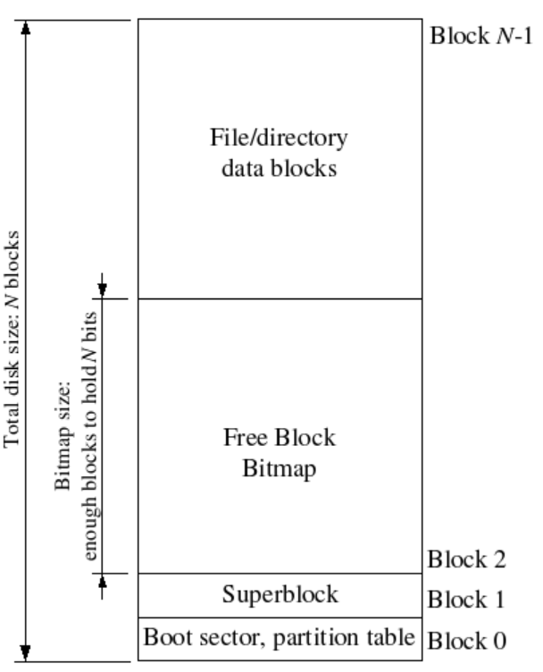
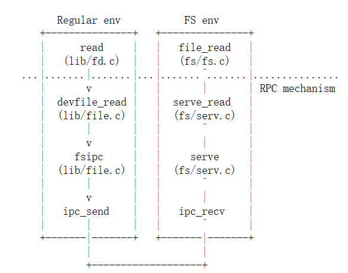
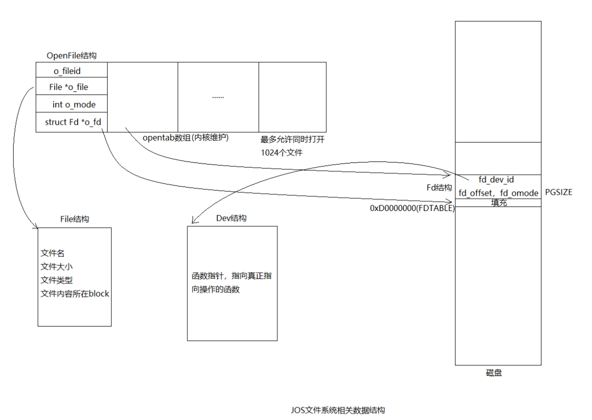

# lab5

## 介绍
在本实验室，你将实现spawn，这是一个库调用，用于加载和运行磁盘上的可执行文件。然后，您将充实内核和库操作系统，以便在控制台中运行shell。这些功能需要一个文件系统，本实验介绍了一个简单的读写文件系统。

### 准备开始
使用Git获取最新版本的课程存储库，然后基于我们的lab5分支origin/lab5创建一个名为lab5的本地分支:

```
git add .
git pull
git checkout -b lab5 origin/lab5
git merge lab4
```

合并过程中，如下文件有冲突：
kern/env.c   
kern/init.c 
kern/pmap.c  
kern/trap.c

依据[所参考博客的github仓库](https://github.com/SmallPond/MIT6.828_OS/tree/master/lab) 以及 https://github.com/shishujuan/mit6.828-2017/tree/lab5 做出修改

这部分实验的主要新组件是文件系统环境，位于新的fs目录中。浏览这个目录中的所有文件，感受一下所有的新内容。此外，在user和lib目录中有一些新的与文件系统相关的源文件：
* fs/fs.c 操纵文件系统磁盘结构的代码。
* fs/bc.c 建立在用户级页错误处理设施之上的简单块缓存。
* fs/ide.c 最小基于PIO(非中断驱动)的IDE (Integrated Drive Electronics，电子集成驱动器 ) 驱动程序代码。
* fs/serv.c 使用文件系统IPC与客户端环境交互的文件系统服务器。
* lib/fd.c 实现通用类unix文件描述符接口的代码。
* lib/file.c 磁盘文件类型的驱动程序，实现为文件系统IPC客户端。
* lib/console.c	 控制台输入/输出文件类型的驱动程序。
* lib/spawn.c spawn库调用的代码框架。

在合并到新的实验5代码之后，您应该再次运行实验4中的pingpong, primes和forktree测试用例。您需要注释掉kern/init.c中的`ENV_CREATE(fs_fs, ENV_TYPE_FS);`行，因为fs/fs.c试图执行一些I/O操作，而JOS还不允许这样做。类似地，暂时将lib/exit.c中对`close_all()`的调用注释掉;这个函数会调用你稍后将在实验中实现的子例程，因此如果被调用，就会出现panic。如果你的lab 4代码不包含任何错误，测试用例应该可以正常运行。在它们正常工作之前不要继续。开始练习1时，不要忘记取消这些行注释。

如果它们不起作用，请使用`git diff lab4`来检查所有更改，确保您为lab 4(或之前)编写的任何代码没有从lab 5中丢失。确保lab 4仍然工作

尝试时出现错误

开始解决问题！！！
参照[出现相同问题博客的解决方法](https://blog.csdn.net/weixin_52877213/article/details/127109658)


修改后，三个测试用例均可以运行，但应该是因为输出格式变了， 所以`python grade-lab4 ` 有的打分不通过，先备份，然后继续进行吧。 并恢复那两行注释的语句。

## File system preliminaries
您将要使用的文件系统比大多数“真正的”文件系统(包括xv6 UNIX的文件系统)要简单得多，但是它足够强大，能够提供基本特性:创建、读取、写入和删除组织在分层目录结构中的文件。

我们(至少目前)只开发了一个单用户操作系统，它提供了足够的保护来捕捉错误，但不能保护多个相互怀疑的用户。因此，我们的文件系统不支持文件所有权或权限的UNIX概念。我们的文件系统目前也不像大多数UNIX文件系统那样支持硬链接、符号链接、时间戳或特殊设备文件。

### 磁盘上文件系统结构
大多数UNIX文件系统将可用的磁盘空间划分为两种主要类型的区域:inode区域和数据区域。UNIX文件系统为文件系统中的每个文件分配一个inode。文件的inode保存了有关文件的关键元数据，如stat属性和指向数据块的指针。数据区域划分为更多的数据块(通常为8KB或更多)，文件系统在其中存储文件数据和目录元数据。目录项包含了文件名和指向inode的指针。如果文件系统中的多个目录项引用了该文件的inode，则称该文件是硬链接(hard-linked)的。**由于我们的文件系统不支持硬链接，我们不需要这种间接级别，因此可以进行方便的简化:我们的文件系统根本不使用inode，只是将文件(或子目录)的所有元数据存储在描述该文件的(唯一的)目录项中。**

文件和目录逻辑上都由一系列数据块组成，这些数据块可能分散在磁盘上，就像环境的虚拟地址空间的页可以分散在物理内存中一样。文件系统环境隐藏了块布局的细节，提供了读取和写入文件中任意偏移位置的字节序列的接口。文件系统环境在内部处理对目录的所有修改，作为执行文件创建和删除等操作的一部分。我们的文件系统确实允许用户环境直接读取目录元数据(例如，使用`read`)，这意味着用户环境可以自己执行目录扫描操作(例如，实现`ls`程序)，而不必依赖对文件系统的额外特殊调用。这种目录扫描方法的缺点是，它使应用程序依赖于目录元数据的格式，在不更改或至少不重新编译应用程序的情况下，很难更改文件系统的内部布局，这也是大多数现代UNIX变体不鼓励使用这种方法的原因。

### 扇区和块
大多数磁盘不能以字节粒度进行读写，而是以扇区为单位进行读写。在JOS中，扇区的长度为512字节。文件系统实际上以块为单位分配和使用磁盘存储。请注意这两个术语之间的区别:扇区长度是磁盘硬件的属性，而块长度是使用磁盘的操作系统的一个方面。文件系统的块大小必须是底层磁盘扇区大小的倍数。

UNIX xv6文件系统使用的块大小为512字节，与底层磁盘的扇区大小相同。然而，大多数现代文件系统使用更大的块大小，因为存储空间已经变得更便宜，并且在更大的粒度上管理存储更加有效。我们的文件系统将使用4096字节的块大小，方便地匹配处理器的页面大小。

### 超级块
文件系统通常会在磁盘上“容易找到”的位置保留某些磁盘块(例如最开始或最末尾)，用于保存描述文件系统整体属性的元数据，例如块大小、磁盘大小、查找根目录所需的任何元数据、文件系统最后一次挂载的时间、文件系统最后一次检查错误的时间，等等。这些特殊的块称为超级块(superblocks)。

我们的文件系统只有一个超级块，它始终位于磁盘的block 1。其布局由inc/fs.h中的struct Super定义。Block 0通常用于保存启动加载程序和分区表，因此文件系统通常不会使用第一个磁盘块。许多“真正的”文件系统维护多个超级块，复制到磁盘上几个分布很广的区域中，这样，如果其中一个超级块损坏了，或者磁盘在该区域发生了介质错误，仍然可以找到其他超级块并用于访问文件系统。

### 文件元数据
在我们的文件系统中描述文件的元数据的布局由inc/fs.h中的struct File描述。这个元数据包括文件的名称、大小、类型(普通文件或目录)，以及指向组成该文件的块的指针。如前所述，我们没有inodes，因此该元数据存储在磁盘上的一个目录项中。与大多数“真实的”文件系统不同，为了简单起见，我们将使用这个文件结构来表示同时出现在磁盘和内存中的文件元数据。

struct File中的f_direct数组包含了存储文件前10个(NDIRECT)块号的空间，我们称之为文件的直接块(direct block)。对于大小不超过10*4096 = 40KB的小文件，这意味着所有文件块的块号将直接放入文件结构本身。然而，对于较大的文件，我们需要一个地方来保存文件其余的块号。因此，对于任何大于40KB的文件，我们分配了一个额外的磁盘块，称为文件的间接块，用于存储最多4096/4 = 1024个额外的块号。因此，我们的文件系统允许文件大小达到1034块，即4兆字节多一点。为了支持更大的文件，“真正的”文件系统通常还支持双重或三重间接块。




### 目录与常规文件
文件系统中的文件结构可以表示普通文件，也可以表示目录;这两种“文件”由文件结构(File structure)中的type字段区分。文件系统以完全相同的方式管理普通文件和目录文件，只是它根本不解释与普通文件相关的数据块的内容，而文件系统将目录文件的内容解释为一系列文件结构，这些文件结构描述了该目录下的文件和子目录。

文件系统中的超级块包含一个文件结构(struct Super中的root字段)，它保存了文件系统根目录的元数据。该目录文件的内容是一系列文件结构，描述了位于文件系统根目录中的文件和目录。根目录下的任何子目录又可能包含更多表示子目录的文件结构，以此类推。

## 文件系统
这个实验的目标不是让您实现整个文件系统，而是让您只实现某些关键组件。**具体来说，你将负责将数据块读取到块缓存中，并将它们刷写回磁盘;分配磁盘块;将文件偏移量映射到磁盘块;并在IPC接口中实现读、写和打开。因为您不会自己实现所有文件系统，所以熟悉所提供的代码和各种文件系统接口非常重要。**

### 磁盘访问
我们操作系统中的文件系统环境需要能够访问磁盘，但我们还没有在内核中实现任何磁盘访问功能。我们没有采用传统的“单体”操作系统策略，即向内核中添加一个IDE磁盘驱动器以及必要的系统调用以允许文件系统访问它，而是将IDE磁盘驱动器实现为用户级文件系统环境的一部分。我们仍然需要稍微修改内核，以便使文件系统环境具有实现磁盘访问所需的权限。

只要我们依赖轮询、基于“编程I/O”(programmed I/O,PIO)的磁盘访问，并且不使用磁盘中断，就可以很容易地在用户空间中实现磁盘访问。在用户态也可以实现中断驱动的设备驱动程序(例如，L3和L4内核会这样做)，但难度更大，因为内核必须对设备中断进行处理，并将其分发到正确的用户态环境。

x86处理器使用EFLAGS寄存器中的IOPL位来确定是否允许保护模式代码执行特殊的设备I/O指令，如IN和OUT指令。由于我们需要访问的所有IDE磁盘寄存器都位于x86的I/O空间中，而不是内存映射，因此为文件系统环境赋予“I/O权限”是我们唯一需要做的，以便允许文件系统访问这些寄存器。实际上，EFLAGS寄存器中的IOPL位向内核提供了一种简单的“全有或全无”方法，用于控制用户态代码是否可以访问I/O空间。在我们的例子中，我们希望文件系统环境能够访问I/O空间，但是我们根本不希望任何其他环境能够访问I/O空间。

### Exercise 1
>练习1
i386_init通过将类型ENV_TYPE_FS传递给创建环境的函数env_create来标识文件系统环境。在env.c中修改env_create，使其赋予文件系统环境的I/O权限，但绝不将该权限赋予任何其他环境。
确保您可以启动文件环境，而不会导致一般保护故障。你应该使用`make grade`通过“fs i/o”测试。

```c
//在env_create()加入如下代码
    //通过修改EFLAGS寄存器中的IOPL位，赋予文件系统环境 I/O权限  
	if (type == ENV_TYPE_FS)  env->env_tf.tf_eflags |= FL_IOPL_MASK;
```
通过“fs i/o”测试！！！！

>问题1
当您随后从一个环境切换到另一个环境时，您是否必须执行其他操作以确保正确地保存和恢复此I/O权限设置?为什么?

答：不用，因为切换环境后随着EFLAGS寄存器值的保存与变换，环境权限自然就保存或者更改了。

请注意，本实验室中的GNUmakefile文件设置QEMU使用obj/kern/kernel.img文件作为磁盘0(通常是DOS/Windows下的“C驱动器”)的镜像，并使用(新)文件obj/fs/fs.img作为磁盘1(“D驱动器”)的镜像。在这个实验室中，我们的文件系统应该只接触磁盘1;磁盘0仅用于引导内核。如果您以某种方式损坏了任何一个磁盘映像，您可以简单地通过输入
```
$ rm obj/kern/kernel.img obj/fs/fs.img
$ make
//或者
$ make clean
$ make
```
将它们重置为原始的“原始”版本

### 块缓存
在我们的文件系统中，我们将借助处理器的虚拟内存系统实现一个简单的“缓冲区缓存”(实际上只是块缓存)。块缓存的代码在fs/bc.c中。

**我们的文件系统只能处理3GB或更小的磁盘。我们保留了文件系统环境地址空间的一个大的、固定的3GB区域，从0x10000000 (DISKMAP)到0xD0000000 (DISKMAP+DISKMAX)，作为磁盘的“内存映射”版本。例如，磁盘块0映射到虚拟地址0x10000000，磁盘块1映射到虚拟地址0x10001000，等等。** fs/bc.c中的diskaddr函数实现了从磁盘块号到虚拟地址的转换(以及一些完整性检查)。

由于我们的文件系统环境有自己的虚拟地址空间，其独立于系统中所有其他环境的虚拟地址空间，并且文件系统环境只需要做一件事就是实现文件访问，因此以这种方式保留文件系统环境的大部分地址空间是合理的。对于32位机器上的真正的文件系统实现来说，这样做是很尴尬的，因为现代磁盘大于3GB。在具有64位地址空间的计算机上，这种缓冲区缓存管理方法可能仍然是合理的。

当然，将整个磁盘读入内存需要很长时间，因此我们将实现一种按需分页的形式，在这种形式中，我们只在磁盘映射区域中分配页，并在该区域出现缺页异常时从磁盘中读取相应的块。这样，我们就可以假装整个磁盘都在内存中。

### Exercise 2
>练习2
实现fs/bc.c中的bc_pgfault和flush_block函数。bc_pgfault是一个缺页异常处理程序，就像您在上一个关于写时复制分支的实验中编写的那样，只是它的工作是从磁盘加载页以响应缺页异常。在写这段代码时，请记住:(1)addr或许是不对齐到块边界（所以需要我们处理一下）;(2)ide_read以扇区而不是块为单位操作。
flush_block函数在必要时将一个块写入磁盘。如果块不在块缓存中(即页没有映射)，或者该页不是脏的，Flush_block不应该做任何操作。我们将使用VM硬件来跟踪磁盘块自最后一次读取或写入磁盘以来是否被修改过。要确定一个块是否需要写入，只需查看uvpt项中的PTE_D“dirty”位是否设置。(PTE_D比特位由处理器设置，以响应对该页的写操作。参见386参考手册第5章5.2.4.3： 处理器硬件设置Accessed and Dirty Bits， 但不清除他们！！！！)在将块写入磁盘之后，flush_block应该使用sys_page_map清除PTE_D位。
使用`make grade`来测试你的代码。你的代码应该通过"check_bc"、"check_super"和"check_bitmap"。

```c
//bc_pgfault
// LAB 5: you code here:
	addr =(void *) ROUNDDOWN(addr, PGSIZE);
	if ( (r = sys_page_alloc(0, addr, PTE_SYSCALL) ) < 0)/*envid 为0即当前环境*/
		panic("bc_pgfault, sys_page_alloc: %e", r);

	if( r= ide_read(blockno * BLKSECTS , addr, BLKSECTS)<0 ) panic("bc_pgfault, ide_read: %e", r);

//flush_block
	//panic("flush_block not implemented");
	int r;
	addr =(void *) ROUNDDOWN(addr, PGSIZE);
	if(va_is_mapped(addr) && va_is_dirty(addr)){
		if(( r= ide_write(blockno * BLKSECTS , addr, BLKSECTS)) < 0 ) 
			panic("flush_block, ide_write: %e", r);

		if( (r= sys_page_map(0,addr,0,addr, /*uvpt[PGNUM(va)] & 不需要，直接按照注释用即可*/ PTE_SYSCALL ) ) < 0 )       
			panic("flush_block, sys_page_map: %e", r);
	}
```
通过测试！！！

fs/fs.c中的fs_init函数是如何使用块缓存的一个主要例子。在初始化块缓存之后，它只是将指针存储到super全局变量中的磁盘映射区域。在这一点上，我们可以简单地从super结构中读取，就像它们在内存中一样，我们的缺页异常处理程序将根据需要从磁盘读取它们。


### 块位图(Bitmap)
在fs_init设置位图指针之后，我们可以将bitmap视为一个位数组，每个位代表磁盘上的一个块。例如，block_is_free函数检查给定的块在位图中是否标记为空闲。

### Exercise 3
>练习3
借鉴free_block，在fs/fs.c中来实现alloc_block时，该函数应在位图中找到一个空闲磁盘块，标记它已使用，并返回该块的编号。在分配块时，应该立即用flush_block将修改后的位图块刷新到磁盘，以保持文件系统的一致性。
使用`make grade`来测试你的代码。你的代码现在应该通过"alloc_block"。

```c
//
int
alloc_block(void)
{
	// The bitmap consists of one or more blocks.  A single bitmap block
	// contains the in-use bits for BLKBITSIZE blocks.  There are
	// super->s_nblocks blocks in the disk altogether.

	// LAB 5: Your code here.
	for(uint32_t i=0; i<super->s_nblocks ; i++){
		if( block_is_free(i) ){
			bitmap[i/32] &=  ~( 1<<(i%32) );//0代表占用
			flush_block(&bitmap[i/32]);
			return i;
		} 
	}
	//panic("alloc_block not implemented");
	return -E_NO_DISK;
}
```
测试通过！！！

### 文件操作
我们在fs/fs.c中提供了各种函数来实现基本的功能，用户需要这些功能来解释和管理File结构，扫描和管理目录文件的条目，以及从根目录遍历文件系统以解析绝对路径名。在继续下一步之前，请通读fs/fs.c中的所有代码，确保你理解了每个函数的作用。

### Exercise 4
>练习4
实现file_block_walk和file_get_block。file_block_walk将文件内的块偏移量映射到struct File中该块或间接块的指针，非常类似于pgdir_walk对页表所做的工作。file_get_block更进一步，映射到实际的磁盘块，在必要时分配一个新的磁盘块。
使用`make grade`来测试你的代码。你的代码应该通过"file_open"、"file_get_block"、"file_flush/file_truncated/file rewrite"和"testfile"。

```c
//file_block_walk
//注释应该是写错了  应该是**ppdiskbno 等于0， 也就是f->f_direct[filebno]为0,即还未分配。
static int
file_block_walk(struct File *f, uint32_t filebno, uint32_t **ppdiskbno, bool alloc)
{
       // LAB 5: Your code here.
       //panic("file_block_walk not implemented");

       int r;
       if (filebno >= NDIRECT + NINDIRECT)  return -E_INVAL;

       if(filebno<NDIRECT){
		*ppdiskbno=& (f->f_direct[filebno]);
		return 0;
       }

       filebno -= NDIRECT;
       //如果   indirect block还没有被分配
       if(f->f_indirect==0){
		if(alloc==0) return -E_NOT_FOUND;
		if((r=alloc_block() )<0 ) return -E_NO_DISK;
		f->f_indirect=r;
		memset(diskaddr(r), 0, BLKSIZE);
		flush_block(diskaddr(r));//刷新回磁盘
       }
       *ppdiskbno = (uint32_t *)diskaddr(f->f_indirect) + filebno;
       return 0;     
}

//file_get_block
int
file_get_block(struct File *f, uint32_t filebno, char **blk)
{

       // LAB 5: Your code here.
       //panic("file_get_block not implemented");
       uint32_t *pdiskbno=NULL;
       int r;
       if( (r = file_block_walk(f, filebno, &pdiskbno, 1)) < 0) return r;

       //file_block_walk(): 有可能f->f_direct[filebno] 或者 间接块项为0, 即还未分配。
       if(*pdiskbno == 0){
		if ( (r = alloc_block()) < 0)  return r;
		*pdiskbno = r;
		memset(diskaddr(r), 0, BLKSIZE);
		flush_block(diskaddr(r));
       }
       // 最终指向块
       *blk = diskaddr(*pdiskbno);
       return 0;
}
```
此处注释上面有疑问，源代码处我已经标注。按照程序推断以及代码最终运行结果来说，应该是注释表述错误。

测试通过！！！

file_block_walk和file_get_block是文件系统的主要工作者。例如，file_read和file_write只是file_get_block上的簿记工作，在分散的块和顺序缓冲区之间复制字节是必需的。

### 文件系统接口
现在文件系统环境本身已经具备了必要的功能，还必须让希望使用该文件系统的其他环境能够访问它。因为其他环境不能直接调用文件系统环境中的函数（见于Exercise 1），所以我们将通过构建在JOS IPC机制之上的远程程序调用(remote procedure call, RPC)来公开对文件系统环境的访问。从图来看，下面是对文件系统服务器的调用(比如read)



虚线下面的所有内容是将读取请求从普通环境获取到文件系统环境的机制。从头开始，read(我们提供的)工作于任何文件描述符，并简单地分派给适当的设备read函数，在本例中是devfile_read(我们可以有更多的设备类型，如管道)。devfile_read专门实现了对磁盘文件的读取。这个函数和lib/file.c中的其他devfile_*函数实现了FS操作的客户端，它们的工作方式大致相同，将参数打包到一个request结构中，调用fsipc发送IPC请求，然后解包并返回结果。fsipc函数只处理向服务器发送请求和接收应答的常见细节。

文件系统服务器的代码可以在fs/serv.c中找到。它在serve函数中循环，无止境地通过IPC接收请求，将请求分派给适当的处理函数，并通过IPC将结果发回。在读取的例子中，serve会分派给serve_read，后者负责处理特定于读取请求的IPC细节，例如解包请求结构，最后调用file_read来实际执行文件读取。

回想一下，JOS的IPC机制允许环境发送单个32位数字，并可选择共享一个页面。要从客户端向服务器发送请求，我们使用32位数字作为请求类型(文件系统服务器的rpc是编号的，就像系统调用编号一样)，并将请求的参数存储在通过IPC共享的页面上的union Fsipc中。在客户端，我们总是在fsipcbuf上共享页面;在服务器端，我们将传入的请求页面映射到fsreq (0x0ffff000)。

服务器也通过IPC发回响应。我们使用32位数字作为函数的返回码。对于大多数rpc，这就是它们返回的全部内容。FSREQ_READ和FSREQ_STAT也返回数据，它们只是将数据写入客户端发送请求的页。不需要在响应IPC中发送此页面，因为客户端首先将其与文件系统服务器共享。此外，在其响应中，FSREQ_OPEN与客户端共享一个新的“Fd page”。我们稍后将返回到文件描述符页面。

### Exercise 5
>练习5
在fs/serv.c中实现serve_read。
serve_read的繁重工作将由fs/fs.c中已经实现的file_read完成(而file_read只是对file_get_block的一些调用)。serve_read只需要提供用于文件读取的RPC接口。查看serve_set_size中的注释和代码，以获得服务器函数应该如何构造的基本概念。
使用`make grade`来测试你的代码。你的代码应该通过"serve_open/file_stat/file_close"和"file_read"，得分为70/150。
另外fs/serv.c中有三种数据结构(struct File;Fd;OpenFile)的描述。

```c
int
serve_read(envid_t envid, union Fsipc *ipc)
{
	struct Fsreq_read *req = &ipc->read;
	struct Fsret_read *ret = &ipc->readRet;

	if (debug)
		cprintf("serve_read %08x %08x %08x\n", envid, req->req_fileid, req->req_n);

	// Lab 5: Your code here:
	//仿照serve_set_size;按照注释填入参数。
	struct OpenFile *o;
	int r;
	if ( (r = openfile_lookup(envid, req->req_fileid, &o) )< 0)   return r;

	if ( (r = file_read(o->o_file, ret->ret_buf, req->req_n, o->o_fd->fd_offset))< 0)  return r;
	// then update the seek position.
	o->o_fd->fd_offset += r;
	return r;
}
```
测试通过！！！

另外 [一篇博客上](https://www.cnblogs.com/gatsby123/p/9950705.html)总结的很生动的一张图：



### Exercise 6
>练习6
在fs/serv.c中实现serve_write，在lib/file.c中实现devfile_write。
使用`make grade`来测试你的代码。你的代码应该通过"file_write"、"file_read after file_write"、"open"和"large file"，得到90/150的分数。

```c
//serve_write
//Extend the file if necessary（这一步其实已经在file_write()中做完了,所以下面我并没有对req->req_n做处理）.
int
serve_write(envid_t envid, struct Fsreq_write *req)
{
	if (debug)
		cprintf("serve_write %08x %08x %08x\n", envid, req->req_fileid, req->req_n);

	// LAB 5: Your code here.
	//panic("serve_write not implemented");
	struct OpenFile *o;
	int r;
	if ( (r = openfile_lookup(envid, req->req_fileid, &o) )< 0)   return r;
	//此处我并没有选择作 req->req_n与容量的比对
	if ( (r = file_write(o->o_file, req->req_buf, req->req_n, o->o_fd->fd_offset)) < 0)   return r;
	// then update the seek position.
	o->o_fd->fd_offset += r;
	return r;	
}

//devfile_write
static ssize_t
devfile_write(struct Fd *fd, const void *buf, size_t n)
{
	// Make an FSREQ_WRITE request to the file system server.  Be
	// careful: fsipcbuf.write.req_buf is only so large, but
	// remember that write is always allowed to write *fewer*
	// bytes than requested.
	// LAB 5: Your code here
	//panic("devfile_write not implemented");

	//参考devfile_read。  fsipcbuf.write.req_buf只有有限大！但允许少写，所以不用 assert()。
	if ( n > sizeof (fsipcbuf.write.req_buf))   n = sizeof (fsipcbuf.write.req_buf);

	fsipcbuf.write.req_fileid = fd->fd_file.id;
	fsipcbuf.write.req_n = n;
	memmove(fsipcbuf.write.req_buf, buf, n);
	//FSREQ_WRITE无需回复页
	return  fsipc(FSREQ_WRITE, NULL);
}
```

## Spawning进程
我们已经给出了spawn的代码(参见lib/spawn.c)，它会创建一个新环境，从文件系统向这个环境中加载程序映像，然后启动运行这个程序的子环境。然后，父进程继续独立于子进程运行。spawn函数实际上就像UNIX中的一个fork，后面是子进程的一个立刻的exec。

我们实现了spawn而不是unix风格的exec，因为spawn更容易在用户空间以“核外方式”实现，而不需要内核的特别帮助。考虑一下在用户空间中实现exec需要做些什么，并确保你理解为什么它更难。

>问题
在用户空间中实现exec需要做些什么，为什么他更难？

答：从spawn代码中我们可以看到它调用sys_exofork()，然后构造栈，随即就向内存中读入段了。而fork()则在其基础上多了一步复制内存映射的过程。也就是说如果要实现与spawn()相同的效果，则exec其实还要写入虚拟内存，进而触发页错误（父进程子进程此时页映射相同）。

### Exercise 7
>练习7
spawn依赖于新的系统调用sys_env_set_trapframe来初始化新创建的环境的状态。在kern/syscall.c中实现sys_env_set_trapframe(不要忘记在syscall()中分派新的系统调用)。
运行kern/init.c中的user/spawnhello程序测试代码，它将尝试从文件系统派生/hello。
使用`make grade`来测试你的代码。


```c
//sys_env_set_trapframe
static int
sys_env_set_trapframe(envid_t envid, struct Trapframe *tf)
{
	// LAB 5: Your code here.
	// Remember to check whether the user has supplied us with a good
	// address!
	//panic("sys_env_set_trapframe not implemented");
	int r;
	struct Env* e;
	if( (r = envid2env(envid, &e, 1)) < 0 ) return r;

	user_mem_assert(e, tf, sizeof(struct Trapframe), 0);

	e->env_tf=*tf;
	e->env_tf.tf_cs|=3;
	e->env_tf.tf_eflags |= FL_IF;
	e->env_tf.tf_eflags &=  ~FL_IOPL_MASK;

	return 0;
}
//syscall
	case SYS_env_set_trapframe:
		return sys_env_set_trapframe(a1, (struct Trapframe*) a2);
```
测试成功！！

### 在fork和spawn之间共享库状态
UNIX文件描述符是一个通用的概念，它还包括管道、控制台I/O等。在JOS中，每种设备类型都有一个对应的struct Dev，其中包含了指向实现 读/写 等 功能的函数的指针。对于该设备类型。lib/fd.c在此基础上实现了通用的类unix文件描述符接口。每个struct Fd都表示其设备类型，lib/fd.c中的大多数函数只是将操作分发给适当的struct Dev中的函数。

lib/fd.c还在每个应用程序环境的地址空间中维护文件描述符表区域，其从FDTABLE开始。该区域为应用程序可以一次性打开的每个最多MAXFD(当前为32)的文件描述符分配一个页面大小(4KB)的地址空间。在任何给定的时间，当且仅当对应的文件描述符正在使用时，才会映射特定的文件描述符表页。每个文件描述符在从FILEDATA开始的区域中都有一个可选的“数据页”，设备可以选择使用它。

我们希望在fork和spawn之间共享文件描述符状态，但文件描述符状态保存在用户空间内存中。现在，在fork上，内存会被标记为写时复制(copy-on-write)，因此状态会被复制而不是共享。(这意味着环境将无法在它们自己没有打开的文件中查找，管道将无法跨分支工作。)在spawn上，内存会被留在后面，根本不会被复制。(实际上，衍生环境一开始没有打开的文件描述符。)

我们将修改fork，以确定某些内存区域由“库操作系统”使用，并且应该始终共享。我们不会在某个地方硬编码一个区域列表，而是在页表项中设置一个未使用的比特位(就像fork中的PTE_COW比特位一样)。

我们在inc/lib.h中定义了一个新的PTE_SHARE位。该位是Intel和AMD手册中标记为“可供软件使用 ( PTE_AVAIL ) ”的三个PTE位之一。我们将建立这样一个约定:如果页表项设置了该比特位，则在fork和spawn中，页表项都应该直接从父进程复制到子进程。请注意，这与标记它为copy-on-write时不同:如第一段所述，我们希望确保将更新共享到页面。

### Exercise 8
>练习8
修改lib/fork.c中的duppage以遵循新的约定。如果页表项设置了PTE_SHARE位，则直接复制映射。(你应该使用PTE_SYSCALL，而不是0xfff，来屏蔽页表项的相关比特位。0xfff也会获取accessed比特位和dirty比特位。)
同样，在lib/spawn.c中实现copy_shared_pages。它应该遍历当前进程中的所有页表项(就像fork那样)，将所有设置了PTE_SHARE位的页映射复制到子进程中。


```c
//duppage 做了几句的修改，为了方便阅读，直接贴上整个函数了
static int
duppage(envid_t envid, unsigned pn)
{
	int r;

	// LAB 4: Your code here.
	//panic("duppage not implemented");
	envid_t this_envid = sys_getenvid();//父进程号
	void * va = (void *)(pn * PGSIZE);

	int perm = uvpt[pn] & PTE_SYSCALL;
	//
	if ( uvpt[pn] & PTE_SHARE ){/* lab5 exercise8 */
		;//空语句，不需要对perm作出修改
	}else if ( (perm & PTE_W) || (perm & PTE_COW) ){
		perm |= PTE_COW;
		perm &= ~PTE_W;
	}

	r=sys_page_map(this_envid, va, envid, va, perm);//一定要用系统调用， 因为权限！！
	if(r<0) return r;

	//如果 PTE_SHARE成立 或者 (perm & PTE_W) || (perm & PTE_COW) 不成立 那么其实这行代码什么操作也没有做，因为perm没变。
	r=sys_page_map(this_envid, va, this_envid, va, perm);
	if(r<0) return r;

	return 0;
}

//copy_shared_pages
static int
copy_shared_pages(envid_t child)
{
	// LAB 5: Your code here.
	int r;
	envid_t this_envid = sys_getenvid();//父进程号

	for (uintptr_t addr = UTEXT; addr < USTACKTOP; addr += PGSIZE) {/*UTEXT: Where user programs generally begin*/
		if ( (uvpd[PDX(addr)] & PTE_P) && (uvpt[PGNUM(addr)] & PTE_P) && (uvpt[PGNUM(addr)] & PTE_SHARE ) ) {
			//Copy the mappings
			if( (r=sys_page_map(this_envid , (void *)addr, child, (void *)addr, uvpt[PGNUM(addr)] & PTE_SYSCALL ) )< 0 ) 
				return r;
		}
	}

	return 0;
}
```

使用`make run-testpteshare`检查代码的行为是否正常。你应该会看到“fork handles PTE_SHARE right”和“spawn handles PTE_SHARE right”。

使用`make run-testfdsharing`检查文件描述符是否被正确共享。你应该会看到“read in child succeeded”和“read in parent succeeded”。

测试成功！！！

## 键盘界面
为了让shell正常工作，我们需要一种方式来键入它。QEMU一直在显示我们写入到CGA显示器和串行端口的输出，但到目前为止，我们只在内核监视器(monitor)中获取输入。在QEMU中，在图形窗口中输入的内容会显示为从键盘到JOS的输入，而在控制台输入的内容会显示为串口上的字符。kern/console.c 已经包含了键盘和串行驱动程序，这些驱动程序从实验1开始就由内核监视器使用，但是现在需要将它们连接到系统的其余部分。

### Exercise 9
>练习9
在kern/trap.c中，调用kbd_intr来处理IRQ_OFFSET+IRQ_KBD，调用serial_intr来处理IRQ_OFFSET+IRQ_SERIAL。

```
	// Handle keyboard and serial interrupts.
	// LAB 5: Your code here.
	case (IRQ_OFFSET + IRQ_KBD):
		lapic_eoi();
		kbd_intr();
		break;
	case (IRQ_OFFSET + IRQ_SERIAL):
		lapic_eoi();
		serial_intr();
		break;
```
我们在lib/console.c中为你实现了控制台输入/输出文件类型。kbd_intr和serial_intr用最近读取的输入填充缓冲区，而控制台文件类型清空缓冲区(控制台文件类型默认用于stdin/stdout，除非用户重定向它们)。

运行`make run-testkbd`并输入几行代码来测试代码。当你完成你的行输入时，系统会将你的其反馈给你。如果控制台和图形窗口都可用，请尝试同时在二者中输入。

## Shell
运行`make run-icode`或`make run-icode-nox`。这将运行你的内核并启动user/icode.icode执行init命令，将控制台设置为文件描述符0和1(标准输入和标准输出)。然后它会生成sh (shell)。你应该能够运行以下命令:
```commend
echo hello world | cat
cat lorem |cat
cat lorem |num
cat lorem |num |num |num |num |num
lsfd
```

注意，用户库例程cprintf直接打印到控制台，而不使用文件描述符代码。这对于调试很有用，但对于通过管道连接到其他程序就不好了。要将输出打印到特定的文件描述符(例如，1，标准输出)，请使用`fprintf(1, "...", ...)`。`printf("...", ...)`是打印到FD 1的快捷方式。以user/lsfdc.c为例。

### Exercise 10
shell不支持I/O重定向。如果能运行`sh <script`，而不是像上面那样必须手动输入脚本中的所有命令，那就太好了。添加 < 到user/sh.c 的I/O重定向。
在shell中输入`sh <script`测试你的实现。
运行`make Run -testshell`来测试你的shell。testshell只是将上述命令(也可以在fs/testshell.sh中找到)提供给shell，然后检查输出是否匹配fs/testshell.key。

```
//user/sh.c
	// LAB 5: Your code here.
	//panic("< redirection not implemented");
	//仿照case '>' ， 参考inc/lib.h
	if ((fd = open(t, O_RDONLY)) < 0) {
		cprintf("open %s for read: %e", t, fd);
		exit();
	}
	if (fd != 0) {
		dup(fd, 0);
		close(fd);
	}
	break;
```

此时，你的代码应该能通过所有测试。

通过所有测试！！！！

这个lab就完成了。别忘了:
```
git status
git diff
git add .
git commit -am 'my solutions to lab 5'
```

