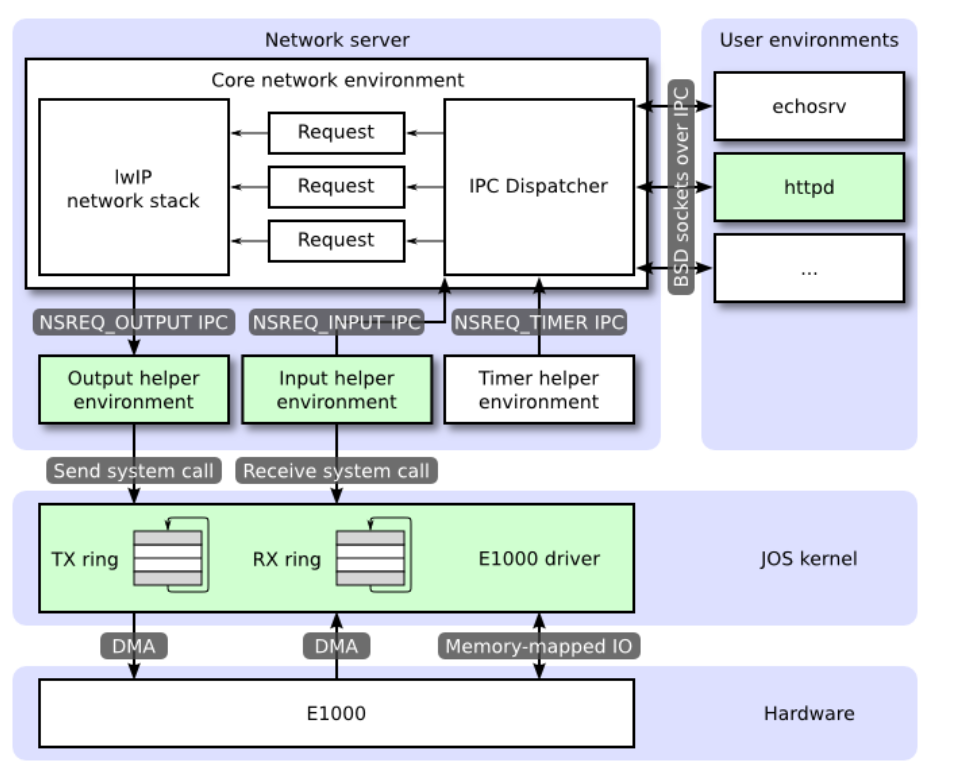
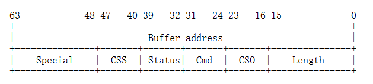
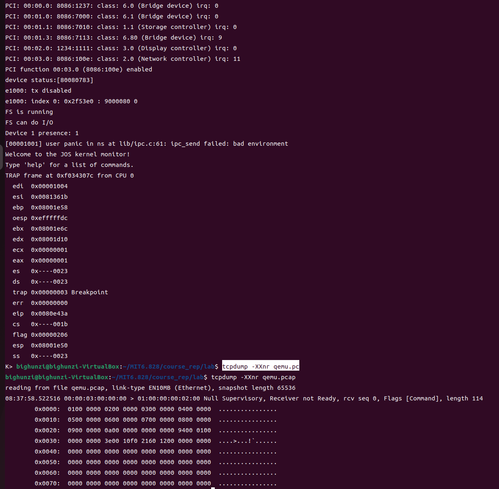

# lab6

## 介绍
既然你已经有了一个文件系统，那么任何操作系统都不应该没有网络堆栈（计算机网络协议栈，TCP/IP协议栈）。在本实验中，您将为网络接口卡编写一个驱动程序。该卡基于英特尔82540EM芯片，也称为E1000。

### 开始
获取lab6
```
git add .
git pull
git checkout -b lab6 origin/lab6
git merge lab5
```
合并过程中，kern/trap.c中冲突，手动进行修改。。

**然而，网卡驱动程序将不足以使您的操作系统连接到互联网。在新的lab6代码中，我们为您提供了一个网络栈和一个网络服务器。与之前的实验室一样，使用git获取此实验室的代码，合并到您自己的代码中，并探索新的net/目录中的内容，以及kern/中的新文件。**

**除了编写驱动程序，您还需要创建一个系统调用接口来访问您的驱动程序。您将实现缺失的网络服务器代码，以在网络堆栈和驱动程序之间传输数据包。您还将通过完成web服务器将所有内容捆绑在一起。使用新的web服务器，您将能够从您的文件系统提供文件。**

大部分内核设备驱动程序代码都必须从头编写。这个实验提供的指导比以前的实验室少得多:没有框架文件，没有系统调用接口，许多设计决策都留给您。出于这个原因，我们建议你在开始任何单独的练习之前阅读整个作业。很多学生觉得这个实验比以前的实验更难，所以请合理地安排时间。

## QEMU的虚拟网络
我们将使用QEMU的用户模式网络堆栈，因为它不需要管理权限即可运行。QEMU的文档在这里有关于user-net的更多信息。我们已经更新了makefile，以启用QEMU的用户模式网络堆栈和虚拟E1000网卡。

默认情况下，QEMU提供了一个运行在IP 10.0.2.2上的虚拟路由器，并将为JOS分配IP地址10.0.2.15。为了简单起见，我们将这些默认值硬编码到net/ns.h的网络服务器中。

虽然QEMU的虚拟网络允许JOS对Internet进行任意连接，但JOS的10.0.2.15地址在QEMU内部运行的虚拟网络之外没有任何意义(也就是说，QEMU充当NAT：NAT网络地址转换)，因此我们不能直接连接到JOS内部运行的服务器，甚至从运行QEMU的主机上也不能。为了解决这个问题，我们配置QEMU，使其在主机上的某个端口上运行服务器，该端口只需连接到JOS中的某个端口，并在真实主机和虚拟网络之间来回传输数据。

您将在端口7 (echo)和端口80 (http)上运行JOS服务器。要查明QEMU转发到开发主机上的哪些端口，请运行`make which-ports`。为了方便起见，makefile还提供了`make nc-7`和`make nc-80`，它们允许您直接与在终端中这些端口上运行的服务器交互。(这些目标只连接到正在运行的QEMU实例;QEMU必须单独启动。)

### 数据包检测
makefile还配置了QEMU的网络堆栈，以记录lab目录中qemu.pcap的所有入/出数据包。

要获取捕获数据包的十六进制/ASCII转储，请使用tcpdump，如下所示:
`tcpdump -XXnr qemu.pcap`

或者，你可以使用Wireshark来图形化地检查pcap文件。Wireshark还知道如何解码和检查数百种网络协议。

### 调试E1000
我们很幸运能够使用模拟硬件。由于E1000是运行在软件上的，模拟的E1000可以以一个用户可读的格式向我们报告其内部状态和它遇到的任何问题。通常，使用裸板编写的驱动程序开发人员无法获得这样的特权。

E1000可以产生大量调试输出，因此必须启用特定的日志记录通道。你可能会发现一些有用的通道:

|  标志位 | 含义  |
|  ----  | ----  |
| tx     | 日志包传输操作 |
| txerr  | 日志传输环路错误 |
| rx | 将更改记录到RCTL |
| rxfilter | 入包日志过滤 |
| rxerr | 记录接收环路错误 |
| unknown | 记录未知寄存器的读写 |
| eeprom | 日志从EEPROM读取数据 |
| interrupt | 记录中断和对中断寄存器的更改 |

例如，要启用“tx”和“txerr”日志记录，可以使用`make E1000_DEBUG=tx,txerr ..`

您可以进一步使用软件模拟硬件进行调试。如果你遇到了问题，不明白为什么E1000没有按照预期的方式响应，你可以在hw/net/e1000.c（啊？）中查看QEMU的E1000实现。

## 网络服务器
**从零开始编写网络堆栈是一项艰苦的工作。相反，我们将使用lwIP，这是一种开源的轻量级TCP/IP协议套件，其中包括一个网络堆栈。你可以在 https://savannah.nongnu.org/projects/lwip/ 找到关于lwIP的更多信息。在本作业中，就我们所知，lwIP是一个实现BSD套接字接口的黑盒，它有一个数据包输入端口和数据包输出端口。**

网络服务器实际上是四种环境的组合：
* 核心网络服务器环境(包括socket call dispatcher和lwIP)
* 输入环境
* 输出环境
* 计时器的环境

下图显示了不同的环境及其关系。该图展示了包括设备驱动程序在内的整个系统，稍后会介绍。在本实验中，你将实现用绿色突出显示的部分。



### 核心网络服务器环境
核心网络服务器环境由套接字调用分配器(socket call dispatcher )和lwIP本身组成。套接字调用分配器的工作方式与文件服务器完全相同。用户环境使用stubs(可以在lib/nsipc.c中找到)将IPC消息发送到核心网络环境。如果你查看lib/nsipc.c，你会发现我们找到核心网络服务器的方式与找到文件服务器的方式相同:i386_init使用NS_TYPE_NS创建了NS环境，因此我们扫描envs，寻找这种特殊的环境类型。对于每个用户环境IPC，网络服务器中的分配器调用由lwIP代表用户提供的适当的BSD套接字接口函数。

普通用户环境不直接使用nsipc_*调用。相反，它们使用lib/sockets.c中的函数，该函数提供了基于文件描述符的套接字API。因此，用户环境通过文件描述符引用套接字，就像它们引用磁盘上的文件一样。有一些操作(connect、accept等)是特定于套接字的，但read、write和close则通过lib/fd. c中普通的文件描述符device-dispatch代码执行。就像文件服务器维护所有打开文件的内部唯一ID一样，lwIP也为所有打开的套接字生成唯一ID。在文件服务器和网络服务器中，我们使用存储在struct Fd中的信息将每个环境下的文件描述符映射到这些唯一的ID空间。

尽管看起来文件服务器和网络服务器的IPC分配器行为相同，但有一个关键的区别。像accept和recv这样的BSD套接字调用可能会无限阻塞。如果调度器让lwIP执行其中一个阻塞调用，那么调度器也会阻塞，并且整个系统一次只能有一个未完成的网络调用。由于这是不可接受的，网络服务器使用用户级线程来避免阻塞整个服务器环境。对于每个传入的IPC消息，dispatcher创建一个线程，并在新创建的线程中处理请求。如果线程阻塞，那么只有该线程进入睡眠状态，而其他线程继续运行。

除了核心网络环境之外，还有三个辅助环境。除了接收来自用户应用程序的消息外，核心网络环境的dispatcher还接收来自输入环境和定时器环境的消息。

### 输出环境
在为用户环境套接字调用提供服务时，lwIP将生成数据包供网卡传输。LwIP将使用NSREQ_OUTPUT IPC消息将每个要传输的数据包发送到输出helper环境，并将数据包附加在IPC消息的page参数中。输出环境负责接受这些消息，并通过系统调用接口将数据包转发到设备驱动程序，您将很快创建该接口。

### 输入环境
网卡接收到的数据包需要注入到lwIP中。对于设备驱动程序接收到的每个数据包，输入环境将其从内核空间提取出来(使用您将实现的内核系统调用)，并使用NSREQ_INPUT IPC消息将数据包发送到核心服务器环境。

包输入功能与核心网络环境是分离的，因为JOS使得输入功能很难同时接受IPC消息和轮询或等待设备驱动程序的包。我们在JOS中没有select系统调用，也就不允许环境监视多个输入源，以确定哪些输入准备被处理。

如果你看一下net/input.c和net/output.c，就会发现它们都需要实现。这主要是因为实现依赖于你的系统调用接口。在实现驱动程序和系统调用接口之后，您将为这两个辅助环境编写代码。

### 计时器环境
定时器环境周期性地向核心网络服务器发送NSREQ_TIMER类型的消息，通知它定时器已经过期。lwIP使用来自该线程的定时器消息来实现各种网络超时。

## Part A: Initialization and transmitting packets
你的内核没有时间的概念，所以我们需要添加它。当前有一个时钟中断，由硬件每10ms产生一次。在每个时钟中断上，我们可以递增一个变量来表示时间提前了10ms。这在kern/time.c中实现，但尚未完全集成到内核中。

### Exercise 1
>练习1
在kern/trap.c中，为每个时钟中断添加对time_tick的调用。实现sys_time_msec，并将其添加到kern/syscall.c中的系统调用，使用户空间能够访问该时间。

```c
//trap_dispatch
    case (IRQ_OFFSET + IRQ_TIMER):
        lapic_eoi();
        time_tick();
        sched_yield();//时间片到达，切换环境
        break;

//sys_time_msec()
static int
sys_time_msec(void)
{
	// LAB 6: Your code here.
	//panic("sys_time_msec not implemented");
	//返回的是ms单位
	return time_msec();
}

//syscall()
    case SYS_time_msec:
        return sys_time_msec();
```

使用`make INIT_CFLAGS=-DTEST_NO_NS run-testtime`来测试时间代码。您应该看到环境以1秒为间隔从5开始倒数。“-DTEST_NO_NS”禁用启动网络服务器环境，因为它将在实验的此时panic。

测试成功！

### 网络接口卡
编写一个驱动程序需要深入了解硬件和呈现给软件的接口。实验文本将提供如何与E1000交互的高层次概述，但您需要在编写您的驱动程序时广泛使用英特尔的手册。

### Exercise 2
>练习2
浏览Intel[软件开发人员手册](https://pdos.csail.mit.edu/6.828/2018/readings/hardware/8254x_GBe_SDM.pdf)的E1000部分。本手册涵盖了几个密切相关的以太网控制器。QEMU模拟82540EM.
你现在应该浏览第2章，对这个设备有个大致的了解。要编写你的驱动程序，你需要熟悉第3章、第14章以及4.1章(虽然不包括4.1章的小节)。你还需要参考第13章。其他章节主要介绍了E1000的组件，你的驱动程序不需要与之交互。现在不要担心细节;只需要对文档的结构有一个感觉，以便稍后找到内容。
在阅读手册时，请记住E1000是一个具有许多高级功能的复杂设备。一个工作的E1000驱动程序只需要网卡提供的功能和接口的一小部分。仔细考虑与网卡交互的最简单方法。我们强烈建议您在使用高级功能之前先安装一个基本的驱动程序。

### PCI接口
E1000是一个PCI设备，这意味着它插入主板上的PCI总线。PCI总线有地址、数据和中断线，它允许CPU与PCI设备通信，并允许PCI设备读写内存。在使用PCI设备之前，需要寻找并初始化该设备。寻找是在PCI总线上寻找连接设备的过程。初始化是分配I/O和内存空间，以及协商设备使用的IRQ线路的过程。

我们已经在kern/pci.c中为您提供了PCI代码。要在启动期间执行PCI初始化，PCI代码会遍历PCI总线寻找设备。在找到设备时，它读取其供应商ID和设备ID，并使用这两个值作为键来搜索pci_attach_vendor数组。该数组由struct pci_driver项组成，如下所示:
```c
struct pci_driver {
    uint32_t key1, key2;
    int (*attachfn) (struct pci_func *pcif);
};
```

如果发现的设备的供应商ID和设备ID与数组中的一项匹配，PCI代码将调用该项的attachfn来执行设备初始化。(设备也可以通过类来标识，kern/pci.c中的另一个驱动程序表就是用来标识设备的。)

attach函数传递给初始化一个PCI函数。PCI卡可以暴露多种功能，但E1000只暴露一种功能。以下是我们在JOS中表示PCI函数的方式:
```c
struct pci_func {
    struct pci_bus *bus;

    uint32_t dev;
    uint32_t func;

    uint32_t dev_id;
    uint32_t dev_class;

    uint32_t reg_base[6];
    uint32_t reg_size[6];
    uint8_t irq_line;
};
```

上述结构反映了开发者手册4.1节表4-1中的一些条目。我们对struct pci_func的最后3项特别感兴趣，因为它们记录了协商后的内存、I/O和设备的中断资源。reg_base和reg_size数组包含最多6个基地址寄存器或BARs的信息。reg_base存储了内存映射的I/O区域的基本内存地址(或I/O端口资源的基本I/O端口)，reg_size包含了reg_base中对应基值的大小或I/O端口的数目，irq_line包含了分配给设备用于中断的IRQ行。表4-2的后半部分给出了E1000 BARs 的具体含义。

在调用设备的attach函数时，已经找到该设备，但尚未启用。这意味着PCI代码尚未确定分配给该设备的资源，例如地址空间和一个IRQ行，因而struct pci_func结构的最后3个成员尚未填充。attach函数应该调用pci_func_enable，该函数将启用设备、协商这些资源并填充struct pci_func。

### Exercise 3
>练习3
实现一个attach函数来初始化E1000。在kern/pci.c的pci_attach_vendor数组中添加一项，以便在找到匹配的PCI设备时触发函数(请确保将其放在标记表结束的{0,0,0}项之前)。大家可以在5.2节中找到QEMU模拟的82540EM的厂商ID **(8086h)** 和设备ID **(100E)**。当JOS在启动时扫描PCI总线时，你还应该看到这些列表。
现在，只需通过pci_func_enable启用E1000设备。我们将在整个实验室中添加更多初始化。
我们已经为您提供了kern/e1000.c和kern/e1000.h文件，以便您不会迷惑于构建系统。它们目前是空白的;你需要在练习中填写它们。您可能还需要在内核的其他地方include e1000.h文件。
启动内核时，应该会看到它打印 the PCI function of the E1000 card was enabled。你的代码现在应该通过pci attach test。

```c
//e1000.h
#include <kern/pci.h>
#define PCI_E1000_VENDOR_ID 0x8086
#define PCI_E1000_DEVICE_ID 0x100E
int pci_e1000_attach(struct pci_func *pcif);

//e1000.c
#include <kern/pci.h>
// LAB 6: Your driver code here
//连接设备
int 
pci_e1000_attach(struct pci_func *pcif) 
{
    pci_func_enable(pcif);
    return 0;
}
```
通过测试！

### 内存映射I/O
软件通过内存映射I/O (MMIO)与E1000通信。您已经在JOS中见过两次:CGA控制台和LAPIC都是通过写入和读取“内存”来控制和查询的设备。但是这些读写不会进入DRAM;它们直接进入这些设备。

pci_func_enable与E1000协商一个MMIO区域，并将其基数和大小存储在BAR 0中(即reg_base[0]和reg_size[0])。这是分配给设备的物理内存地址范围，这意味着你必须通过虚拟地址来访问它。由于MMIO区域被分配了非常高的物理地址(通常高于3GB)，由于JOS的256MB限制，您不能使用KADDR来访问它。因此，您必须创建一个新的内存映射。我们将使用MMIOBASE上面的区域(来自实验4的mmio_map_region将确保我们不会覆盖LAPIC使用的映射)。由于PCI设备初始化是在JOS创建用户环境之前进行的，因此您可以在kern_pgdir中创建映射，它将始终可用。

### Exercise 4
>练习4
在您的attach函数中，通过调用mmio_map_region(您在实验4中编写的)为E1000的BAR 0创建一个虚拟内存映射。
你可能希望将这个映射的位置记录在一个变量中，以便稍后可以访问刚刚映射的寄存器。kern/lapic.c中的lapic变量即是一种实现方法的例子。如果确实使用了指向设备寄存器映射的指针，请确保将其声明为volatile;否则，编译器允许缓存值并重新排序对该内存的访问。
要测试映射，可以尝试打印出设备状态寄存器(第13.4.2节)。这是一个4字节的寄存器，从寄存器空间的第8字节开始。你会得到0x80080783，这表明全双工链路的速率为1000 MB/s。

>volatile关键字说明！！！
volatile提醒编译器它后面所定义的变量随时都有可能改变，因此编译后的程序每次需要存储或读取这个变量的时候，告诉编译器对该变量不做优化，都会直接从变量内存地址中读取数据，从而可以提供对特殊地址的稳定访问。
如果没有volatile关键字，则编译器可能优化读取和存储，可能暂时使用寄存器中的值，如果这个变量由别的程序更新了的话，将出现不一致的现象。（简洁的说就是：volatile关键词影响编译器编译的结果，用volatile声明的变量表示该变量随时可能发生变化，与该变量有关的运算，不要进行编译优化，以免出错）

```c
//e1000.h
    #define E1000_STATUS   0x00008  /* Device Status - RO */
//e1000.c
    #define E1000_LOCATE(offset)  (offset >> 2) //很巧妙的写法
    volatile uint32_t *e1000;
    //pci_e1000_attach()
    e1000=mmio_map_region(pcif->reg_base[0],pcif->reg_size[0]);
    cprintf("device status:[%x]\n", e1000[E1000_LOCATE(E1000_DEVICE_STATUS)] );/*打印设备状态寄存器， 用来测试程序*//*打印设备状态寄存器， 用来测试程序*/
```

测试成功！！

提示:你需要很多常量，比如寄存器的位置和位掩码的值。尝试从开发人员的手册中复制这些内容是容易出错的，错误可能会导致痛苦的调试过程。我们建议使用QEMU的[e1000_hw.h](https://pdos.csail.mit.edu/6.828/2018/labs/lab6/e1000_hw.h)头文件作为指导。我们不建议一字不差地复制它，因为它定义的东西比你实际需要的多得多，而且可能不会按你需要的方式定义东西，但这是一个很好的起点。

### DMA(Direct Memory Access 直接内存访问)
你可以想象通过写入和读取E1000的寄存器来发送和接收数据包，但这会很慢，并且需要E1000在内部缓冲数据包数据。相反，E1000使用直接内存访问(DMA)直接从内存读写数据包数据，而不涉及CPU。驱动程序负责为发送和接收队列分配内存，设置DMA描述符，并配置E1000与这些队列的位置，但之后的一切都是异步的。**为了传输一个数据包，驱动程序将其复制到传输队列中的下一个DMA描述符，并通知E1000有另一个数据包可用。（所以这也是cpu做的！！！）** 当有时间发送数据包时，E1000将从描述符中复制数据。同样地，当E1000接收到一个数据包时，它将其复制到接收队列中的下一个DMA描述符，驱动程序可以在下一个机会读取该描述符。

接收队列和发送队列在高层上非常相似。它们都由一系列描述符组成。虽然这些描述符的确切结构各不相同，但每个描述符都包含一些标志和一个包含数据包的缓冲区的物理地址(要么是网卡要发送的数据包，要么是操作系统为网卡分配的一个缓冲区，用于写入接收到的数据包)。

这些队列以循环数组的形式实现，这意味着当网卡或驱动程序到达数组末尾时，它会重新回到数组的开头。它们都有一个头指针和一个尾指针，队列的内容是这两个指针之间的描述符。硬件总是从头部消耗描述符并移动头部指针，而驱动总是向尾部添加描述符并移动尾部指针。发送队列中的描述符表示等待发送的数据包(因此，在稳定状态下，发送队列为空)。对于接收队列，队列中的描述符是空闲描述符，网卡可以接收到数据包并存入这些描述符(因此，在稳定状态下，接收队列由所有可用的接收描述符组成)。正确更新尾部寄存器而不混淆E1000是很棘手的;小心!

**描述符中指向这些数组的指针，以及数据包缓冲区的地址，都必须是物理地址，因为硬件直接在物理物理内存之间执行DMA，而不需要经过MMU。**

### 报文转发
E1000的发送和接收功能基本上是相互独立的，所以我们可以一次处理一个。我们首先应对发送数据包，因为如果不先发送“I'm here!”数据包，我们就无法测试接收。

首先，你必须按照14.5节(不需要关注子节)中描述的步骤初始化要传输的网卡。传输初始化的第一步是建立传输队列。队列的精确结构在3.4节描述，描述符的结构在3.3.3节描述。我们不会使用E1000的TCP offload特性，所以你可以专注于“传统的传输描述符格式”。你现在应该阅读这些章节，熟悉这些结构。

### C结构
你会发现用C语言的结构体来描述E1000的结构很方便。正如你在struct Trapframe等结构中看到的那样，C结构体允许你在内存中精确地布局数据。E1000的结构如下安排。**如果遇到字段对齐问题，请查看GCC的“packed”属性。**

举个例子，考虑手册中表3-8给出的传统传输描述符:


该结构的第一个字节从右上角开始，因此要将其转换为C结构体，需要从右向左、从上到下读取。如果你仔细看，你会发现所有字段都可以很好地符合标准大小的类型:
```c
//lab中所要求的结构体
struct e1000_tx_desc
{
	uint64_t addr;
	uint16_t length;
	uint8_t cso;
	uint8_t cmd;
	uint8_t status;
	uint8_t css;
	uint16_t special;
} __attribute__ ((packed));/* 要求16字节边界上对齐 */
```

**你的驱动程序必须为传输描述符数组和传输描述符指向的数据包缓冲区预留内存。有几种方法可以做到这一点，从动态分配页到简单地在全局变量中声明页。无论您选择什么，请记住E1000直接访问物理内存，这意味着它访问的任何缓冲区在物理内存中必须是连续的。**

**还有多种方法可以处理数据包缓冲区。最简单的方法是，在驱动程序初始化期间为每个描述符预留一个数据包缓冲区，简单地将数据包复制到这些预分配的缓冲区中，我们建议从这里开始。** 以太网数据包的最大长度是1518字节，这是缓冲区大小的限制。更复杂的驱动程序可以动态分配数据包缓冲区(例如，在网络使用率较低时，用于减少内存开销)，**甚至可以传递用户空间直接提供的缓冲区(一种称为“零拷贝”的技术，可以在很多八股文中找到关于这个的讲解。。。。。。)**，但最好从简单的驱动程序开始。

### Exercise 5
>练习5
执行14.5节描述的初始化步骤(不包括它的子节)。使用第13节作为初始化过程涉及的寄存器的参考，使用第3.3.3节和第3.4节作为发送描述符和发送描述符数组的参考。
注意传输描述符数组的对齐要求和对数组长度的限制。由于TDLEN必须是128字节对齐的，并且每个传输描述符是16字节，因此您的传输描述符数组将需要8个传输描述符的倍数。但是，不要使用超过64个描述符，否则我们的测试将无法测试传输环溢出。
对于TCTL.COLD，你可以假设全双工操作。对于TIPG，请参考[IEEE 802.3 IPG标准](https://pdos.csail.mit.edu/6.828/2018/readings/hardware/8254x_GBe_SDM.pdf)13.4.34节表13-77中描述的默认值(不要使用14.5节中表中的值)。

```
//此处只写主函数了。如有需要，其余宏，全局变量等定义去源码中找吧
void
e1000_transmit_init()
{
	//参考文档14.5节步骤
	/*1.为传输描述符列表分配一个内存区域，确保内存在16字节边界上对齐。 此步骤在函数外的变量定义过程中已经完成
	* 2. 用区域地址对传输描述符基址(TDBAL/TDBAH)寄存器进行编程，将传输描述符长度(TDLEN)寄存器设置为描述符环的大小(以字节为单位)。 将0b写入传输描述符头部和尾部（TDH/TDT）寄存器。
	* 3. 初始化传输控制寄存器(TCTL) 包括：TCTL.EN置1； TCTL.PSP置1；TCTL.CT置为10h；TCTL.COLD置为40h。
	* 4. 参考IEEE 802.3 IPG标准 设置TIPG寄存器
	*/
	//1.操作描述符。这部分不在14.5中体现，我们需要参考3.3.3将它完成。
	// addr，length其实都应该用上这描述符后再赋值，但我们是静态内存，所以就直接对addr初始化了。
	memset(e1000_tx_desc_array, 0 , sizeof(struct e1000_tx_desc) * TX_DESC_ARRAY_SIZE);
	for (int i = 0; i < TX_DESC_ARRAY_SIZE; i++) {
		e1000_tx_desc_array[i].addr=PADDR(e1000_tx_buffer[i]);
		e1000_tx_desc_array[i].cmd = E1000_TXD_CMD_RS | E1000_TXD_CMD_EOP;//设置RS位。由于每个包只用一个数据描述符，所以也需要设置EOP位
		e1000_tx_desc_array[i].status = E1000_TXD_STATUS_DD;//要置1, 不然第一轮直接就默认没有描述符用了
	}
	//2.
	e1000[E1000_LOCATE(E1000_TDBAL) ]= PADDR(e1000_tx_desc_array);
	e1000[E1000_LOCATE(E1000_TDBAH) ] = 0;
	e1000[E1000_LOCATE(E1000_TDLEN) ] = sizeof(struct e1000_tx_desc)*TX_DESC_ARRAY_SIZE;
	e1000[E1000_LOCATE(E1000_TDH) ] = 0;
	e1000[E1000_LOCATE(E1000_TDT) ] = 0;

	//3.
	e1000[E1000_LOCATE(E1000_TCTL) ] |= E1000_TCTL_EN | E1000_TCTL_PSP | (E1000_TCTL_CT & (0x10 << 4)) | (E1000_TCTL_COLD & (0x40 << 12));

	//4. {IPGT,IPGR1,IPGR2}分别为 {10,8,6}
	e1000[E1000_LOCATE(E1000_TIPG)] = E1000_TIPG_IPGT | (E1000_TIPG_IPGR1 << E1000_TIPG_IPGR1_SHIFT) | (E1000_TIPG_IPGR2 << E1000_TIPG_IPGR2_SHIFT);
}
```
测试成功！！！

试着运行`make E1000_DEBUG=TXERR,TX qemu`。如果您正在使用课程qemu，您应该在设置TDT寄存器时看到“e1000: tx disabled”消息(因为这在您设置TCTL.EN之前发生)，并且没有进一步的“e1000”消息。

现在transmit已经初始化，接下来必须编写代码来传输一个数据包，并通过系统调用让用户空间可以访问它。要传输一个数据包，必须将它添加到发送队列的尾部，这意味着将数据包的数据复制到下一个数据包缓冲区，然后更新TDT(transmit descriptor tail, 发送描述符尾部)寄存器，以通知网卡在发送队列中有另一个数据包。**(注意，TDT是传输描述符数组的索引，而不是字节偏移量。文档对此不是很清楚。)**

然而，发送队列只有这么大。如果卡没有及时发送数据包，而发送队列已满，会发生什么情况?为了检测这种情况，需要从E1000得到一些反馈。不幸的是，你不能只使用TDH (transmit descriptor head，传输描述符头)寄存器;文档明确说明从软件中读取这个寄存器是不可靠的。然而，如果你在发送描述符的命令字段中设置了RS位，那么当网卡在该描述符中传输了数据包时，网卡将在该描述符的状态字段中设置DD位。如果一个描述符的DD位设置了，你就可以放心地回收该描述符并使用它来传输另一个数据包。

如果用户调用了传输系统调用，但是下一个描述符的DD位没有被设置，表明传输队列已满，该怎么办?你得决定在这种情况下该怎么做。你可以简单地扔掉包裹。网络协议对此是有弹性的，但如果您丢弃大量突发的数据包，协议可能无法恢复。相反，可以告诉用户环境它必须重试，就像sys_ipc_try_send所做的那样。这样做的好处是可以向后推生成数据的环境。

### Exercise 6
>练习6
编写一个函数，检查下一个描述符是否空闲，将数据包数据复制到下一个描述符，并更新TDT。确保你处理了发送队列已满的情况。

```c
int 
e1000_transmit(void *addr, size_t len)
{
	size_t tdt = e1000[E1000_LOCATE(E1000_TDT)] ;//TDT寄存器中存的是索引！！！
	struct e1000_tx_desc * tail_desc = &e1000_tx_desc_array[tdt];
	if(!(tail_desc->status & E1000_TXD_STATUS_DD) ) return -1;//传输队列已满

	memcpy(e1000_tx_buffer[tdt] , addr, len);
	tail_desc->length = (uint16_t )len;
	tail_desc->status &= (~E1000_TXD_STATUS_DD);//清零DD位。
	e1000[E1000_LOCATE(E1000_TDT)]= (tdt+1) % TX_DESC_ARRAY_SIZE;

	return 0;
}
```

现在是测试数据包传输代码的好时机。尝试通过直接从内核调用transmit函数来传输几个数据包。要测试这个，你不需要创建符合任何特定网络协议的数据包。运行`make E1000_DEBUG=TXERR,TX qemu`来运行测试。你应该看到类似这样的东西:
```
e1000: index 0: 0x271f00 : 9000002a 0
...
```

当你发送数据包时。每一行都给出了传输数组中的索引、传输描述符的缓冲区地址、cmd/CSO/length字段和special/CSS/status字段。如果QEMU没有从传输描述符中打印出预期的值，请检查您是否填写了正确的描述符，并且正确配置了TDBAL和TDBAH。如果你得到“e1000: TDH wraparound @0, TDT x, TDLEN y”消息，这意味着e1000一直在传输队列中运行，没有停止(如果QEMU没有检查这一点，它将进入无限循环)，这可能意味着你没有正确操作TDT。如果你收到很多“e1000: tx disabled”的消息，那么你没有正确设置发送控制寄存器。

一旦QEMU运行，您就可以运行`tcpdump -XXnr qemu.pcap`查看你传输的数据包数据。如果你从QEMU看到了预期的“e1000: index”消息，但你的数据包捕获是空的，请仔细检查你是否填写了发送描述符中每个必要的字段和位(e1000可能已经通过了你的发送描述符，但认为它不需要发送任何内容)。

在init.c中添加测试程序：
```c
	int test_val[10]={1,2,3,4,5,6,7,8,9,10};
	e1000_transmit( test_val ,128);//尝试传128字节
```
测试结果：

测试成功！

### Exercise 7
添加一个系统调用，让您可以从用户空间传输数据包。具体的接口由你决定。不要忘记检查任何从用户空间传递到内核的指针。

```
// 另外 别忘了 inc/syscall.h中 enum元素 SYS_e1000_try_send的定义。
//以及 inc/lib.h中添加函数声明
int 
sys_e1000_try_send(void *buf, size_t len)
{
	user_mem_assert(curenv, buf, len, PTE_U);
	return e1000_transmit(buf, len);
}

	case SYS_e1000_try_send:
		return sys_e1000_try_send((void *)a1, (size_t)a2);


//还有！！！
//别忘了lib/syscall.c中对应的修改。 很关键！！！！ 我找了半天。
//原因还是自己之前不理解系统调用过程！！！！！
int
sys_e1000_try_send(void *buf, size_t len)
{
    return syscall(SYS_e1000_try_send, 0, (uint32_t)buf, len, 0, 0, 0);
}
```

### 发送数据包:网络服务器
现在您已经有了设备驱动程序传输端的系统调用接口，接下来是发送数据包的时候了。输出助手环境(也就是net/output.c)的目标是在循环中执行以下操作:从核心网络服务器接收NSREQ_OUTPUT IPC消息，并使用刚才添加的系统调用将这些IPC消息附带的数据包发送到网络设备驱动程序。NSREQ_OUTPUT IPC是由net/lwip/jos/jif/jif.c中的low_level_output函数发送的，它将lwIP堆栈粘贴到JOS的网络系统上。每个IPC将包含一个由union Nsipc组成的页面，在其struct jif_pkt pkt字段中包含包(参见inc/ns.h)。struct jif_pkt：
```c
struct jif_pkt {
    int jp_len;
    char jp_data[0];
};
```

jp_len表示数据包的长度。IPC页上的所有后续字节都专用于数据包的内容。在结构体末尾使用像jp_data这样的零长度数组是一种常见的C技巧(有些人会说令人讨厌)，用于表示没有预先确定长度的缓冲区。由于C语言不进行数组边界检查，只要你确保在结构体之后有足够的未使用内存，就可以像使用任何大小的数组一样使用jp_data。

当设备驱动程序的传输队列中没有更多空间时，请注意设备驱动程序、输出环境和核心网络服务器之间的交互。核心网服务器使用IPC向输出环境发送数据包。如果输出环境由于发送数据包的系统调用（ sys_e1000_try_send() ）而挂起，因为驱动程序没有更多的缓冲区来容纳新数据包，核心网络服务器将阻塞，等待输出服务器接受IPC调用。

### Exercise 8
>练习8
完成net/output.c.

```c
void
output(envid_t ns_envid)
{
	binaryname = "ns_output";

	// LAB 6: Your code here:
	// 	- read a packet from the network server
	//	- send the packet to the device driver
	int r, perm;
	envid_t from_env;
	while(1){
		r=ipc_recv( &from_env , &nsipcbuf, NULL);
		if(r!=NSREQ_OUTPUT || from_env!=ns_envid){
			continue;
		} 
		while( sys_e1000_try_send( nsipcbuf.pkt.jp_data, nsipcbuf.pkt.jp_len ) < 0 ){
			sys_yield();//发送失败，切换进程，让出控制器，提高效率。
		}
	}
}
```

你可以使用net/testoutput.c来测试输出代码，而无需涉及整个网络服务器。试着运行`make E1000_DEBUG=TXERR,TX run-net_testoutput`。你应该看到类似这样的东西:
```
Transmitting packet 0
e1000: index 0: 0x271f00 : 9000009 0
Transmitting packet 1
e1000: index 1: 0x2724ee : 9000009 0
...
```

以及`tcpdump -XXnr qemu.pcap`应输出:
```
reading from file qemu.pcap, link-type EN10MB (Ethernet)
-5:00:00.600186 [|ether]
	0x0000:  5061 636b 6574 2030 30                   Packet.00
-5:00:00.610080 [|ether]
	0x0000:  5061 636b 6574 2030 31                   Packet.01
...
```

要使用更大的数据包计数进行测试，请尝试设置`E1000_DEBUG=TXERR,TX NET_CFLAGS=-DTESTOUTPUT_COUNT=100 run-net_testoutput`。如果它溢出了你的发送环，仔细检查你正在正确地处理DD状态位，并且你已经告诉硬件设置了DD状态位(使用RS命令位)。

你的代码应该通过`make grade`的testoutput测试。

测试通过！！！！

>问题1
你是如何构建你的传输实现的?特别是，如果发送环路满了怎么办?

答：发送环路满了，挂起切换环境。


## Part B: Receiving packets and the web server

### 接受数据包
就像发送数据包一样，你需要配置E1000来接收数据包，并提供一个接收描述符队列和接收描述符。3.2节描述了数据包接收的工作方式，包括接收队列结构和接收描述符，而初始化过程将在14.4节详细描述。

### Exercise 9
>练习9
阅读3.2节。你可以忽略任何与中断，校验和卸载有关的内容(如果你决定以后使用这些功能，可以回到这些部分)，不必关心阈值的细节以及卡的内部缓存是如何工作的。

接收队列与发送队列非常相似，不同之处在于它由空的分组缓冲区组成，等待收到的数据包填充。因此，在网络空闲时，发送队列是空的(因为所有分组都已经发送)，而接收队列是满的(由空分组缓冲区组成)。

当E1000接收到一个数据包时，它首先检查它是否与网卡配置的过滤器匹配(例如，查看数据包是否指向这个E1000的MAC地址)，如果数据包与任何过滤器都不匹配，则忽略它。否则，E1000尝试从接收队列的头部检索下一个接收描述符。如果头部(RDH)赶上了尾部(RDT)，则接收队列超出了空闲描述符，因此网卡丢弃数据包。如果有空闲的接收描述符，则将数据包数据复制到描述符指向的缓冲区中，设置描述符的DD (Descriptor Done)和EOP (End of packet)状态位，并增加RDH。

如果E1000在一个接收描述符中接收到一个比数据包缓冲区大的数据包，它将从接收队列中检索所需数量的描述符来存储数据包的全部内容。为了表示这种情况已经发生，它会在所有描述符上设置DD状态位，但只在最后一个描述符上设置EOP状态位。您可以在您的驱动程序中处理这种可能性，或者简单地配置网卡不接受“长数据包”(也称为巨型帧)，并确保您的接收缓冲区足够大，以存储最大的可能的标准以太网数据包(1518字节)。

### Exercise 10
>练习10
按照14.4节中的过程建立接收队列并配置E1000。您不必支持“长数据包”或多播。现在，不要配置网卡来使用中断。如果您决定使用接收中断，则稍后可以更改此设置。此外，配置E1000以剥离以太网CRC，因为grade脚本希望它被剥离。
默认情况下，该卡将过滤掉所有数据包。您必须将接收地址寄存器(RAL和RAH)配置为网卡自己的MAC地址，以便接收到该网卡的数据包。你可以简单地硬编码QEMU的默认MAC地址52:54:00:12:34:56(我们已经在lwIP中硬编码了，所以在这里也这样做不会让事情变得更糟)。注意字节顺序;MAC地址从最低位字节写到最高位字节，因此52:54:00:12是MAC地址的低阶32位，34:56是高阶16位。
E1000只支持一组特定的接收缓冲区大小(在13.4.22中对RCTL.BSIZE的描述中给出)。如果您将接收数据包的缓冲区设置得足够大，并禁用长数据包，则不必担心数据包跨越多个接收缓冲区。另外，请记住，就像传输队列一样，接收队列和数据包缓冲区在物理内存中必须是连续的。
你应该至少使用128个接收描述符。

```c
void
e1000_receive_init()
{
	//接收地址寄存器
	e1000[E1000_LOCATE(E1000_RA)] = QEMU_DEFAULT_MAC_LOW;
	e1000[E1000_LOCATE(E1000_RA) + 1] = QEMU_DEFAULT_MAC_HIGH | E1000_RAH_AV;

	//处理描述符
	memset(e1000_rx_desc_array, 0, sizeof(e1000_rx_desc_array) );
	for (int i = 0; i < RX_DESC_ARRAY_SIZE; i++) {
		e1000_rx_desc_array[i].addr = PADDR(e1000_rx_buffer[i]);
	}

	e1000[E1000_LOCATE(E1000_RDBAL)] = PADDR(e1000_rx_desc_array);
	e1000[E1000_LOCATE(E1000_RDBAH)] = 0;
	e1000[E1000_LOCATE(E1000_RDLEN)] = sizeof(e1000_rx_desc_array);
	e1000[E1000_LOCATE(E1000_RDH)] = 0;
	e1000[E1000_LOCATE(E1000_RDT)] = RX_DESC_ARRAY_SIZE-1;//尾指针的下一个才是真尾巴，即真正软件要把它复制过来的数据包

	e1000[E1000_LOCATE(E1000_RCTL)] = E1000_RCTL_EN | E1000_RCTL_BAM  |  E1000_RCTL_SZ_2048 | E1000_RCTL_SECRC;	
}
```

您现在可以对接收功能进行基本测试，甚至不需要编写接收数据包的代码。运行`make E1000_DEBUG=TX,TXERR,RX,RXERR,RXFILTER run-net_testinput`。testinput将传输一个ARP(Address Resolution Protocol, 地址解析协议)通知包(使用您的包传输系统调用)，QEMU将自动回复它。即使你的驱动程序还没有收到这个回复，你应该看到一个 “e1000: unicast match[0]: 52:54:00:12:34:56”的消息，表明一个包被e1000接收并匹配配置的接收过滤器。如果你看到一个“e1000: unicast mismatch: 52:54:00:12:34:56”的消息，e1000会过滤掉这个数据包，这意味着你可能没有正确配置RAL和RAH。确保你得到了正确的字节顺序，并且没有忘记设置RAH中的“Address Valid”位。如果您没有收到任何“e1000”消息，则可能没有正确启用receive。

测试成功！！！！

现在可以实现接收数据包了。为了接收一个数据包，你的驱动程序必须跟踪它希望保存下一个接收到的数据包的描述符。与传输类似，文档指出，RDH寄存器不能从软件中可靠地读取，因此为了确定数据包是否已经发送到描述符的数据包缓冲区，你必须读取描述符中的DD状态位。如果设置了DD位，就可以从该描述符的数据包缓冲区中复制数据包数据，然后通过更新队列的尾部索引RDT来告诉网卡该描述符是空闲的。

如果没有设置DD位，则表示没有收到报文。在接收端，这相当于发送队列已满，在这种情况下可以做几件事。你可以简单地返回一个“try again”错误，并要求调用者重试。虽然这种方法适用于满的传输队列，因为这是一种瞬态条件，但对于空的接收队列来说，这种方法就不太合理了，因为接收队列可能会在很长一段时间内保持空状态。第二种方法是暂停调用环境 **（这个太麻烦了，就先不写了）**，直到接收队列中有数据包需要处理为止。该策略与sys_ipc_recv非常类似。就像IPC的情况一样，由于每个CPU只有一个内核栈，因此一旦离开内核，栈上的状态就会丢失。我们需要设置一个标志，表明环境已经通过接收队列下溢挂起，并记录系统调用参数。这种方法的缺点是复杂:必须指示E1000生成接收中断，而驱动程序必须处理这些中断，以便恢复阻塞的，正在等待一个数据包的环境。


### Exercise 11
>练习11
编写一个函数从E1000接收一个数据包，并通过添加一个系统调用将其暴露给用户空间。确保能够处理空的接收队列。

```c
//系统调用接口实现就不罗列了， 有了上文传输接口的练习，应该不会有遗漏了。
int 
e1000_receive(void *addr, size_t *len)//要把长度取出来，后面struct jif_pkt需要记录长度的
{
	size_t tail = e1000[E1000_LOCATE(E1000_RDT)];
	size_t next = (tail+1)% RX_DESC_ARRAY_SIZE;//真尾巴

	if( !(e1000_rx_desc_array[next].status & E1000_RXD_STAT_DD) ){
		return -1;//队列空
	}

	*len=e1000_rx_desc_array[next].length;
	memcpy(addr, e1000_rx_buffer[next] , *len);

	e1000_rx_desc_array[next].status &= ~E1000_RXD_STAT_DD;//清零DD位
	e1000[E1000_LOCATE(E1000_RDT)] = next;

	return 0;
}
```

### 接收数据包:网络服务器
在网络服务器输入环境中，你需要使用新的receive系统调用来接收数据包，并使用NSREQ_INPUT IPC消息将它们传递给核心网络服务器环境。这些IPC输入消息应该有一个附带有union Nsipc的页面，其中union Nsipc包含struct jif_pkt pkt字段，其中填写了从网络接收到的数据包。

### Exercise 12
>练习12
实现net/input.c

```c
void
sleep(int msec)
{
    unsigned now = sys_time_msec();

    while (msec > sys_time_msec()-now){
    	sys_yield();
    }    
}

void
input(envid_t ns_envid)
{
	binaryname = "ns_input";

	// LAB 6: Your code here:
	// 	- read a packet from the device driver
	//	- send it to the network server
	// Hint: When you IPC a page to the network server, it will be
	// reading from it for a while, so don't immediately receive
	// another packet in to the same physical page.
	size_t len;
	char rev_buf[RX_PACKET_SIZE];
	while(1){
		while ( sys_e1000_recv(rev_buf, &len)  < 0) {
			sys_yield();//没东西读，就阻塞，切换别的环境。    
		}
		memcpy(nsipcbuf.pkt.jp_data, rev_buf, len);
		nsipcbuf.pkt.jp_len = len;

		ipc_send(ns_envid, NSREQ_INPUT, &nsipcbuf, PTE_P|PTE_U);

		sleep(30);//停留一段时间，不停留的话，测试不会通过，会丢包。
	}
}


```

再次运行testinput，`make E1000_DEBUG=TX,TXERR,RX,RXERR,RXFILTER run-net_testinput`。你应该看到：
```
Sending ARP announcement...
Waiting for packets...
e1000: index 0: 0x26dea0 : 900002a 0
e1000: unicast match[0]: 52:54:00:12:34:56
input: 0000   5254 0012 3456 5255  0a00 0202 0806 0001
input: 0010   0800 0604 0002 5255  0a00 0202 0a00 0202
input: 0020   5254 0012 3456 0a00  020f 0000 0000 0000
input: 0030   0000 0000 0000 0000  0000 0000 0000 0000
```
以“input:”开头的行是QEMU的ARP回复的十六进制转储。

你的代码应该能通过`make grade`的testinput测试。请注意，如果不发送至少一个ARP包来通知QEMU JOS的IP地址，就无法测试包接收，因此传输代码中的bug可能会导致测试失败。

为了更全面地测试网络代码，我们提供了一个名为echosrv的守护进程，它在端口7上设置了一个echo服务器，可以回显通过TCP连接发送的任何内容。使用`make E1000_DEBUG=TX,TXERR,RX,RXERR,RXFILTER run-echosrv`在一个终端中启动echo服务器，并在另一个终端中连接nc-7。你输入的每一行都应该被服务器回显。模拟的E1000每次接收到数据包时，QEMU都应该在控制台中打印如下内容:
```
e1000: unicast match[0]: 52:54:00:12:34:56
e1000: index 2: 0x26ea7c : 9000036 0
e1000: index 3: 0x26f06a : 9000039 0
e1000: unicast match[0]: 52:54:00:12:34:56
```

至此，你应该也能通过echosrv测试了。

测试成功！！！

>问题2
你是如何构建你的receive实现的?特别是，如果接收队列为空，而用户环境请求下一个传入的数据包，该怎么办?

答：队列为空，切换环境。由于服务器需要时间处理nsipcbuf，所以ipc之间要停留一段时间。这段时间也切换环境，让出CPU。

### Web服务器
web服务器以最简单的形式将文件的内容发送给请求的客户机。我们已经在user/httpd.c中提供了一个非常简单的web服务器的框架代码。框架代码处理传入的连接并解析头部。

### Exercise 13
web服务器缺少将文件内容发送回客户端的代码。通过实现send_file和send_data来完成web服务器。

```c
//send_file()
	// LAB 6: Your code here.
	struct Stat st;
	if ( (r = open(req->url, O_RDONLY) )< 0 ) {
		return  send_error(req, 404);
	}
	fd = r;
	// 怎么判断一个fd 是目录， 没有 num2fd
	if ( (r = fstat(fd, &st)) < 0) return send_error(req, 404);

	if (st.st_isdir) return send_error(req, 404);

	file_size = st.st_size;
	//panic("send_file not implemented");


static int
send_data(struct http_request *req, int fd)
{
	// LAB 6: Your code here.
	//panic("send_data not implemented");
	// 从fd 中读size大小数据，并发送
	int r;
	size_t len;
	char buf[BUFFSIZE];
	if ( (r = read(fd, buf, BUFFSIZE)) < 0 )  return -1;

	len = r;
	if ( write(req->sock, buf, len) != len) {
		die("Failed to send bytes to client");
	}
	return 0;
}
```

一旦你完成了web服务器,启动web服务器(`make run-httpd-nox`)并在浏览器输入http://host:port/index.html ,host是电脑运行QEMU的名字（hostname是localhost）， port是`make which-ports`使得web服务器报告的端口号。您应该看到由运行在JOS中的HTTP服务器提供的web页面。

此时，`make grade`将得到 105/105 分。

测试通过！！！

>问题3
JOS的web服务器提供的web页面说了什么?

答：cheesy web page

完成实验！！ 别忘了：
```
git commit -am '完成整个lab6'
```